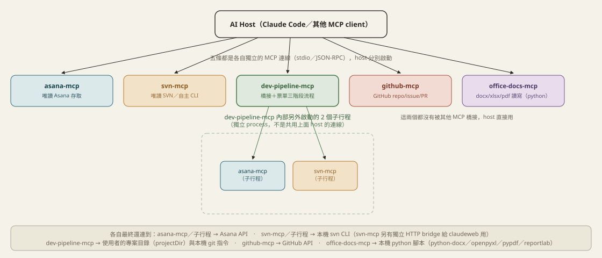
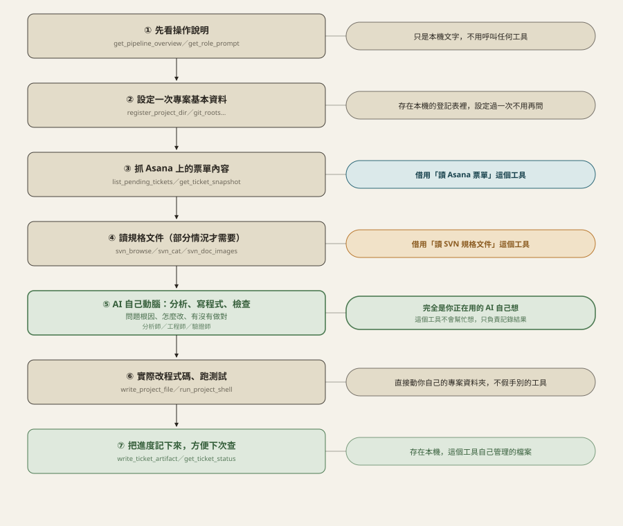

# mcp-tools

個人維護的一組 MCP server，供 Claude Code（或其他支援 MCP 的 AI/host）驅動日常開發與 Asana 票單處理流程。

## 目錄

| 目錄 | 說明 |
|---|---|
| `asana-mcp` | 唯讀 Asana 存取（共用帳號 token）——workspaces/projects/board/task/comments |
| `svn-mcp` | 自主的 SVN 存取——直接執行本機 `svn` CLI，不依賴任何網站服務；也提供一個獨立的 HTTP bridge（`dist-exe/` 打包成 .exe）讓其他服務（例如 claudeweb）依賴它 |
| `dev-pipeline-mcp` | 「Asana 票單 → 分析師 → 工程師 → 驗證師」全自動流程，橋接上面兩個 MCP；專案↔目錄的登記、`get_recent_commits`（抓 commit 記錄）都是自己本機維護/實作的 |
| `github-mcp` | 個人 GitHub（Personal Access Token）——repo/issue/PR 管理 |
| `office-docs-mcp` | Word（.docx）／Excel（.xlsx）／PDF／CSV 的讀取／寫入／建立／刪除——包一層 Node/TS 呼叫 `scripts/` 底下的 python 腳本（python-docx／openpyxl／pypdf／reportlab／內建 csv 模組），不橋接也不被任何其他 MCP 橋接 |
| `db-mcp` | 從 claudeweb 抽出來的資料庫存取——顯式的專案分組（Project → Connection → SQLite schema 快取），PK/FK/索引內省、AI 表格筆記、寫死在程式碼裡的唯讀查詢把關（AI 只能 SELECT，寫入語句一律拒絕並請使用者自行手動執行）。之後也會像 `svn-mcp` 一樣提供一個 HTTP bridge 讓 claudeweb 依賴，屆時 claudeweb 不再自己維護連線設定或 JDBC 邏輯 |

## 架構圖解

### 你的 AI 同時可以用哪些工具



- 這 5 個工具（技術上叫 MCP server）各自是獨立的小程式，AI 個別連上就能用，彼此不知道對方存在。
- 只有 `dev-pipeline-mcp`（自動處理 Asana 票單全流程）比較特別：它自己內部又另外啟動了一份 `asana-mcp`／`svn-mcp` 來用（見 `mcp-clients.ts`），是完全獨立的第二份，不是跟 AI 直連的那兩份共用；`github-mcp`／`office-docs-mcp` 沒有被誰借用。
- `svn-mcp` 另外有一個給 `claudeweb`（另一個內部網頁工具）用的介面，跟這裡講的「工具借用工具」是兩回事。

> 這個 repo 原本還有一個獨立的 `spec-pipeline-mcp`（讀單一規格檔案 → 分析 → 改程式 → 驗證，不掛 Asana），2026-09-09 已經整個併入 `dev-pipeline-mcp` 並淘汰——它原本服務的「建置案」情境其實也是從 Asana 派工，規格一律讀 SVN，不需要另外一條獨立流程或本機同步一份規格檔案。

### 自動處理 Asana 票單：每一步實際在做什麼



一次性設定（專案/目錄/SA-SD/git roots）都存在本機，不用借用任何工具；真正會借用其他工具的只有兩步：抓票單、讀規格。分析問題、寫程式碼、判斷對不對這幾步，完全是你正在用的 AI 自己想，這個工具只負責記錄結果，不會幫忙思考。

## 各自的連線/憑證資料

每個 MCP 的連線資訊（token、SVN 帳密等）都放在自己目錄底下的 `info/`（已加進 `.gitignore`，不會進版控），是各自獨立維護的個人副本，不跟任何其他系統共用同一份檔案。

## 安裝

每個子目錄都是獨立的 npm 專案：

```bash
cd asana-mcp && npm install && npm run build
cd ../svn-mcp && npm install && npm run build
cd ../dev-pipeline-mcp && npm install && npm run build
cd ../github-mcp && npm install && npm run build
cd ../office-docs-mcp && npm install && npm run build
cd ../db-mcp && npm install && npm run build
```

`office-docs-mcp` 額外需要本機 Python 環境裝好 `python-docx`／`openpyxl`／`pypdf`／`reportlab`（`pip install python-docx openpyxl pypdf reportlab`），Node 端只是包一層呼叫 `scripts/*.py`。

## 為什麼放在同一個 repo

這幾個 MCP 大多彼此有橋接關係（`dev-pipeline-mcp` 會把另外兩個當子行程啟動），放在同一個 repo 方便一起看歷史、一起改版，不用切換好幾個 repo。各自的 `package.json`/`.gitignore` 仍然獨立，互不影響。`office-docs-mcp`／`db-mcp` 目前是獨立的兩個，沒有跟其他 MCP 橋接，純粹是圖方便管理放進同一個 repo。
