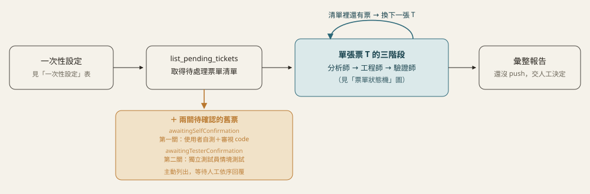
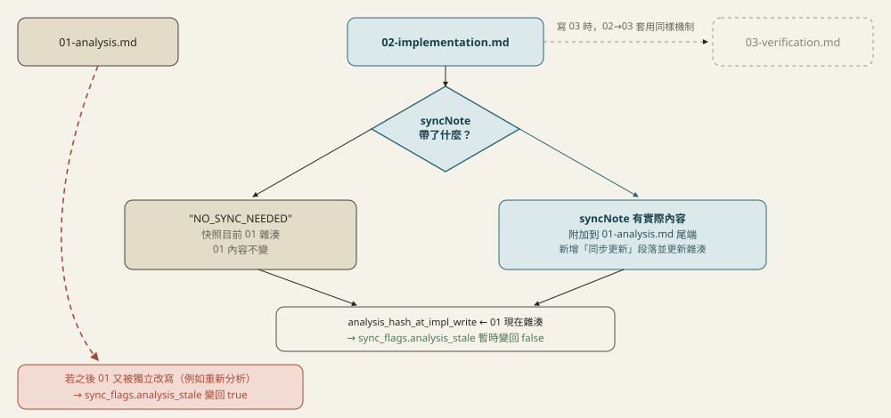
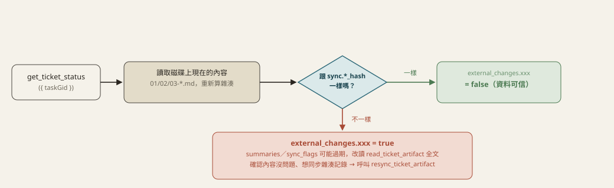
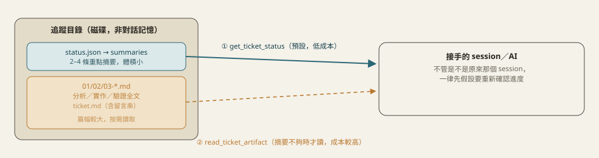

# asana-pipeline-mcp

獨立的 MCP server，讓**任何**支援 MCP 的 AI/host（不限 Claude Code）都能驅動「Asana 票單 → 分析師 → 工程師 → 驗證師」這條自動處理流程。

## 這個 MCP 不會自己思考

跟內建呼叫某家模型 API 的「agent MCP」不同，這個 server **完全不呼叫任何 LLM**、不需要模型 API key。它只做兩件事：提供工具（抓票單、讀寫程式碼、跑 shell、管理追蹤紀錄）跟提供角色說明（`get_pipeline_overview`／`get_role_prompt`）。實際的分析、寫程式碼、驗證判斷，都是**連上這個 MCP 的那個 AI 自己的模型**在做——接 Claude、GPT、Gemini 都能用。

## 安裝與設定

```bash
npm install
npm run build
```

這個 MCP 是「橋接」設計，本身沒有 Asana token、不自己讀寫 SVN，轉呼叫兩個既有 MCP；「Asana 專案↔目錄」「git 版控根目錄」這兩份登記表是自己本機維護的：

| 依賴 | 用途 |
|---|---|
| [`asana-mcp`](../asana-mcp) | 抓 Asana 票單/看板/留言（唯讀） |
| [`spec-pipeline-mcp`](../spec-pipeline-mcp) | 只借 `get_recent_commits`，目錄登記不經過它 |
| [`svn-mcp`](../svn-mcp) | SA/SD 規格文件在 SVN 上的瀏覽/讀取（唯讀） |

啟動時會自動把這三個當子行程啟動，**必須先各自 `npm install && npm run build` 過**。

<details>
<summary>環境變數</summary>

| 變數 | 說明 | 預設值 |
|---|---|---|
| `ASANA_MCP_PATH` | asana-mcp 的 `dist/index.js` 絕對路徑 | `../asana-mcp/dist/index.js` |
| `SPEC_PIPELINE_MCP_PATH` | spec-pipeline-mcp 的 `dist/index.js` 絕對路徑 | `../spec-pipeline-mcp/dist/index.js` |
| `SVN_MCP_PATH` | svn-mcp 的 `dist/index.js` 絕對路徑 | `../svn-mcp/dist/index.js` |
| `ASANA_PIPELINE_DATA_DIR` | 本機輕量資料（票單索引/登記表/`file-write-state.json`）存放目錄；票單內容本身在各專案的 `.asana-pipeline/` 底下 | `./data` |

`svn-mcp` 被當子行程啟動會繼承父行程環境變數，所以 `SVN_API_BASE`/`SVN_CONNECTION_ID` 只要帶在啟動 `asana-pipeline-mcp` 的 `env` 裡就生效。Asana token 設在 `asana-mcp` 那邊。

</details>

### 建議：在你自己的全域 CLAUDE.md 加一條規則

`.asana-pipeline/` 底下的追蹤檔案有機會被使用者或另一個沒有走這條 pipeline 的 AI 直接用一般 Edit/Write 手動改到——這種情況這個 MCP 完全不知情（見下方「外部修改偵測」），而且**只有在有人明確呼叫 `get_ticket_status`/`read_ticket_artifact` 時才會被抓到，不會主動通知**。

比較可靠的做法是把提醒放進**你自己的全域 CLAUDE.md**（例如 `~/.claude/CLAUDE.md`），因為那份檔案不管在哪個專案目錄開新 session 都會被自動讀到，涵蓋範圍比只寫在這個 MCP 的 prompt 裡（只有真的呼叫 `get_pipeline_overview`/`get_role_prompt` 才讀得到）廣很多。建議加一段類似：

```markdown
## Asana Pipeline 追蹤檔案同步規則

任何專案目錄下只要有 .asana-pipeline/ 資料夾，一律適用：
- 直接用 Edit/Write 改了裡面的 01/02/03-*.md（沒透過 write_ticket_artifact）之後，
  接著呼叫 resync_ticket_artifact({ taskGid, filename }) 同步雜湊記錄。
- 不確定追蹤狀態是不是最新的，先呼叫 get_ticket_status 看 external_changes，
  任一個 _externally_modified 是 true 就重新讀全文，不要只信快取摘要。
```

這終究是提醒 AI 自己記得做，不是工具層級的強制——真正的安全網是「外部修改偵測」那組機制本身（見下方），這段只是提高被看到、被處理的機率。

### 一次性設定（每個 Asana 專案通常只問一次）

| 工具 | 設定什麼 |
|---|---|
| `resolve_default_project` / `register_default_project` | 今天要看哪個 Asana 專案 |
| `resolve_project_dir` / `register_project_dir` | 對應哪個本機/伺服器程式碼目錄 |
| `resolve_sasd_config` / `register_sasd_config` | SA/SD 規格放哪、模式為何（見下表） |
| `resolve_git_roots` / `register_git_roots` | 前後端各自的 git 版控根目錄 |

### SA/SD 規格四種模式

| 模式 | 適用情境 | 規則 |
|---|---|---|
| `external` | 規格是客戶/第三方產的 | 只能參考，不能建議修改 SD，只調整程式碼配合 |
| `self` | 規格是自己團隊產的 | 可在報告裡建議修改段落，但不寫回 SVN（唯讀） |
| `self-generated` | 沒有既有規格，AI 自己維護 | 真的寫進 `sdOutputPath` 指定的本機檔案 |
| `unregistered` | 不登記，逐票詢問 | 唯一每張票都要單獨問「有沒有 SD」的模式 |

---

## 流程圖解

### 每次執行的迴圈



`list_pending_tickets` 每次呼叫都會多回傳兩份清單：`awaitingSelfConfirmation`（AI 驗證師判過 `PASS`、Asana 內容也沒再變過，但**使用者自己還沒實際測過＋審視程式碼品質**的票）跟 `awaitingTesterConfirmation`（第一關已經過了，但**另一位獨立測試員的情境測試還沒表態**的票）。這兩份清單每次都要主動列給使用者看（不因為這次是來處理別的新票就略過），直到每一張都依序呼叫 `record_self_confirmation` 再 `record_tester_confirmation` 表態，才會從清單消失。

### 單張票的狀態機


六格 `stage`（灰）只會往前走，不會跳過也不會倒退；`snapshot` 下的灰圈是省 token 捷徑（內容雜湊沒變就不重寫、不回全文）。紅卡有兩張：右上角是內容變動的例外——`verified` 且 `PASS` 之後若偵測到 Asana 內容真的變了，會亮起 `needs_reanalysis` 旗標逼下一輪重新分析、`verdict`、`self_confirmation`、`tester_confirmation` 一併清空，但 **`stage` 本身不會倒退**，仍顯示 `verified`；下方較寬那張是 **`verdict: FAIL` 的根因分流**——`advance_ticket_stage` 設 `FAIL` 時必填 `rootCause`（`"analysis"`/`"implementation"`），AI 依此自動跳回分析師或工程師重跑，不用停下來問使用者，`consecutive_fail_count` 由工具機械式維護（FAIL 累加、PASS 歸零），達到門檻（`needs_human_review`，預設連續 3 次）才停下來問。

黃卡是另一個獨立軸向、而且分兩關：`verified` 且 `PASS`、內容也沒再變的情況下，票單會先落入「待第一關（使用者自己）確認」——**`verdict` 是 AI 驗證師自己判的結論，不等於真正結案**。使用者呼叫 `record_self_confirmation({ taskGid, confirmed: true })` 之後，才會進到「待第二關（另一位獨立測試員）確認」；測試員呼叫 `record_tester_confirmation({ taskGid, confirmed: true })`，才會真正進入綠卡「已結案」。**任一關 `confirmed: false`（回報有問題）都會把 `verdict` 重設回 `null`、標記 `humanRejected: true`，重新套用跟上面 `FAIL` 完全一樣的根因分流機制**，不是留給人工事後自己判斷、也不是另開一條獨立流程；第二關的工具本身也會擋下「第一關還沒過就想記錄第二關」的呼叫。這整段狀態轉換只落在本地追蹤檔案裡，**不會回寫到 Asana 本身**——`asana-mcp` 刻意設計成唯讀，Asana 上要不要標記完成一律交由使用者自己手動處理。

### 01/02/03 互相同步



跟上一張圖是不同軸向的雜湊比對：那張管「票單原文 vs 追蹤系統」，這張管「01/02/03 三份文件彼此」。`write_ticket_artifact` 寫 02/03 時 `syncNote` 是必填欄位（可以填 `NO_SYNC_NEEDED`，但不能不填），逼呼叫端每次都對「要不要同步」做一次明確判斷——這是這條 pipeline 曾經反覆修正十幾輪、分析文件完全沒跟上、全靠使用者事後肉眼發現的問題換來的強制檢查。

### 外部修改偵測



跟上一張「01/02/03 互相同步」圖是不同軸向的比對：那張比的是「兩份都是這個 MCP 自己以前記錄的雜湊」彼此對不對得起來（`sync_flags`）；這張比的是「這個 MCP 記錄的舊雜湊」跟「磁碟上現在真正的內容」對不對得起來（`external_changes`）——**只有這組比對才抓得到「使用者或別的沒走這條 pipeline 的 AI，直接手動編輯了追蹤檔案」這種情況**，因為 `sync_flags` 用的兩個雜湊都只在呼叫 `write_ticket_artifact` 時才會更新，繞過它就不會被更新到，拿兩個「一樣沒被更新過」的舊值互相比，永遠看起來「一致」。

`get_ticket_status` 每次呼叫都會當場重新讀一次 01/02/03 現在的內容、重新算雜湊，回傳裡的 `external_changes.{analysis,implementation,verification}_externally_modified` 任一個是 `true`，就代表對應那份文件被外部改過——這個工具不會自動修正，只負責誠實回報；確認過修改沒問題、想把雜湊記錄同步回目前內容，另外呼叫 `resync_ticket_artifact`。這個機制不需要任何人記得做什麼，純粹是被動的、每次查詢都會自己重算的偵測，不像「叫 AI 記得同步」那樣不可靠。

### 待人工處理清單（`PENDING_HUMAN_ACTIONS.md`）

過去「這張票需要你確認」「這個 SQL 只能你手動執行」這類提醒，只會在當次聊天回覆裡講一次——換個 session、關掉對話視窗，這份清單就沒了，只能重新問 AI 才會再看到一次。

現在 `list_pending_tickets({ projectGid, projectName, sectionFilter? })` **只要帶 `projectName`**，每次呼叫都會把當下算出來的四類「需要人工處理」項目整份覆寫進 `<projectDir>/.asana-pipeline/<projectName>/PENDING_HUMAN_ACTIONS.md`：

1. **待你確認**——AI 驗證師判 PASS，等你自己實測＋審視程式碼品質。
2. **待測試員確認**——你已經確認過，等另一位獨立測試員的情境測試。
3. **卡住需要你介入**——連續 `FAIL` 已經達到門檻（`needs_human_review`），AI 不會再自動重跑。
4. **需要你手動處理的事項**——來自 `write_ticket_artifact` 寫 02/03 時**必填**的 `manualActions` 參數（可以是空陣列，代表明確確認這次沒有）。典型例子是「已產出 SQL，只能由你到 Database 工具手動執行」——這類一次性提醒過去只寫在 02/03 全文或聊天視窗裡，換個 session、或沒仔細重讀全文就會被漏掉，現在強制工程師/驗證師每次都要明確宣告一次，不能只埋在自由文字裡。

這份檔案不需要任何人記得手動維護——它是 `list_pending_tickets` 每次呼叫的**副作用**，跟這條 pipeline 每次執行都一定會呼叫這個工具的既有規則綁在一起，不是一個容易被忘記呼叫的額外步驟。檔案本身會被整份覆寫，不要手動編輯。

### 換 session／換 AI 接手



追蹤狀態落地在磁碟，不是活在對話記憶裡。每個角色開始前先看 `get_ticket_status` 摘要，只有漏掉關鍵細節才多花一次 tool call 呼叫 `read_ticket_artifact` 讀全文。

> 想看跟著系統亮/暗主題切換、可縮放的互動版：clone 這個 repo 後用瀏覽器打開 [`docs/pipeline-overview.html`](docs/pipeline-overview.html)（GitHub 網頁只顯示 `.html` 原始碼，不會渲染）。

---

## 追蹤目錄放在哪裡

建在**目標程式碼專案自己的目錄**，不是這個 MCP 的安裝目錄：

```
<projectDir>/.asana-pipeline/<Asana 專案全名稱>/<票號>/<子票號>/...   （子任務巢狀，層數不限，自動偵測）
```

分享/交接這個工具本身不會夾帶任何客戶票單內容——內容全部留在各專案目錄。第一次建立追蹤目錄時會在該專案 `CLAUDE.md` 附加一段說明（不覆蓋既有內容）。`data/tickets-index.json` 只存 `{ taskGid: 目錄路徑 }` 對照表，不含票單內容。

---

## 提供的工具

<details>
<summary>展開完整工具清單（23 個）</summary>

| 工具 | 用途 |
|---|---|
| `get_pipeline_overview` | 取得整條流程說明（第一步一定先呼叫） |
| `get_role_prompt` | 取得分析師／工程師／驗證師其中一個角色的職責說明 |
| `resolve_default_project` / `register_default_project` | 查詢/登記「今天的問題單」預設 Asana 專案 |
| `list_pending_tickets` | 列出某個 Asana 專案尚未處理完成的票單；附上 `awaitingSelfConfirmation`/`awaitingTesterConfirmation`（AI 已 PASS、還卡在兩關人類確認的舊票）、`needsHumanReview`（連續 FAIL 已達門檻）、`manualActions`（有待使用者手動處理事項的票），一般待處理清單裡也會標記 `humanRejected: true`（人類打回、需比照 AI 驗證師 FAIL 處理的票）。**帶 `projectName` 會把這四類整份寫進 `PENDING_HUMAN_ACTIONS.md`**（見下方說明） |
| `get_ticket_snapshot` | 抓票單內容＋留言，寫入追蹤檔案；子任務自動偵測（讀 Asana `parent` 欄位） |
| `resolve_project_dir` / `register_project_dir` | 查詢/登記 Asana 專案 → 程式碼目錄 |
| `resolve_sasd_config` / `register_sasd_config` | 查詢/登記 SA/SD 規格設定；`external`/`self` 會真的驗證 SVN 連線才登記成功 |
| `read_project_sd_doc` / `write_project_sd_doc` | 讀寫「自維護」SD 文件（`self-generated` 專用），寫在 `sdOutputPath` 真實本機檔案 |
| `get_sd_spec_template` / `get_sd_spec_versioning_rules` | SD 規格撰寫範本／版更規範，寫入前應先呼叫其中之一 |
| `svn_list_connections` / `svn_test_connection` | 轉呼叫 svn-mcp，列出/測試 SVN 連線 |
| `svn_browse` / `svn_cat` / `svn_doc_images` / `svn_log` | 轉呼叫 svn-mcp 讀 SVN 上的規格（唯讀），一律讀遠端不讀本機 checkout |
| `get_recent_commits` | 查某目錄最近的 git commit（轉呼叫 spec-pipeline-mcp） |
| `read_project_file` / `write_project_file` / `list_project_dir` / `search_project_text` | 讀寫/搜尋專案檔案（限 `projectDir` 範圍內）；偵測外部修改，見下方安全限制 |
| `resolve_git_roots` / `register_git_roots` | 查詢/登記專案目錄實際的 git 版控根目錄（可前後端分開） |
| `run_project_shell` | 跑 shell 指令；git 指令會驗證版控根目錄，見下方安全限制 |
| `get_ticket_status` / `advance_ticket_stage` | 讀取/更新票單追蹤狀態，附 `sync_flags`/`needs_human_review`/`external_changes`（當場重新讀磁碟比對，抓繞過 MCP 的手動修改）；`verdict`（AI 驗證師結論）、`self_confirmation`（第一關：使用者自測＋審視 code）、`tester_confirmation`（第二關：獨立測試員情境測試）、`verifier_root_cause`（FAIL 根因，供自動路由）是分開的欄位。`verdict: "FAIL"` 時 `rootCause` 必填（`"analysis"`/`"implementation"`），並會機械式維護 `consecutive_fail_count`（FAIL 累加/PASS 歸零）、清空兩關人類確認 |
| `write_ticket_artifact` / `read_ticket_artifact` | 讀寫追蹤目錄下的分析/實作/驗證檔案；寫 02/03 時 `syncNote`/`manualActions` 都必填（`manualActions` 可以是空陣列） |
| `resync_ticket_artifact` | 把 01/02/03 其中一份檔案「現在磁碟上的實際內容」重新雜湊、寫回 `sync.*_hash`——給直接手動改過追蹤檔案（沒走 `write_ticket_artifact`）之後，用最低成本同步雜湊記錄，不用跑完整流程 |
| `record_sasd_check` | 記錄這張票有沒有對應 SA/SD；沒呼叫過會擋下 `01-analysis.md` 的寫入 |
| `record_self_confirmation` | 記錄結案第一關——使用者自己的實測＋程式碼品質審視結果（`confirmed`/`note`），只能在 `verified` 階段之後呼叫；`confirmed: true` 才會讓票單從 `awaitingSelfConfirmation` 移到 `awaitingTesterConfirmation` |
| `record_tester_confirmation` | 記錄結案第二關（最終關）——另一位獨立測試員的情境測試結果（`confirmed`/`note`），只能在第一關 `self_confirmation` 已經 `confirmed: true` 之後才能呼叫；`confirmed: true` 才會讓票單真正離開待確認清單、算結案 |

</details>

## 安全限制

- `run_project_shell` 拒絕 `git push`、`--force`/`-f`、`reset --hard`、`clean`、`checkout --`/`checkout .`、`restore`、`branch -D`；其餘 git 指令正常可用。
- 任何 git 指令執行前會驗證：`projectDir` 必須先 `register_git_roots` 登記過，且指令實際解析到的 repo root 要跟登記的一致，避免在沒有獨立 `.git` 的子目錄誤跑 `add`/`commit`。
- `read_project_file`/`write_project_file`/`list_project_dir`/`search_project_text`/`run_project_shell` 都限制在提供的 `projectDir` 範圍內，跳出範圍的路徑一律拒絕。
- `write_project_file` 會記住自己上次寫入每個檔案的內容雜湊：偵測到外部修改（其他工具/使用者/別的 AI 改過）預設擋下寫入，要帶 `acknowledgeExternalChange: true` 才會覆蓋。
