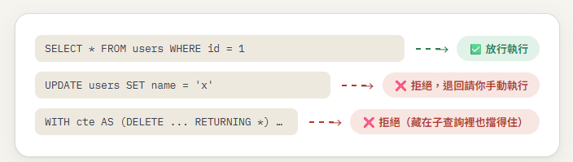

# db-mcp

獨立的資料庫存取 MCP，設計成給任何 AI 助理用的資料庫工具：顯式的專案分組、SQLite 快取 schema（含 PK/FK/索引）、AI 可以寫回去的表格筆記，以及寫死在程式碼裡的唯讀查詢把關（不是靠規則檔靠 AI 自己記得）。

## 這是怎麼運作的


AI 助理只會透過這支工具查詢，不會直接拿到帳號密碼——連線設定（含密碼）只存在 `info/db-connections.json` 這一份檔案，回傳給 AI 的連線資訊一律先去掉密碼欄位。

## 資料模型

```
Project（建置案/翻修案）
  └─ Connection（環境：dev/test/staging/prod，各自的帳密/host/port）
       └─ 一次 db_schema 同步 → 寫進這個專案的 SQLite 快取
```

- `info/projects.json`：專案登記表
- `info/db-connections.json`：連線設定（含密碼，**這個 MCP 是連線登記的唯一來源**）
- `info/projects/<projectId>/schema.sqlite`：這個專案所有連線共用一份 schema 快取
  - `tables`/`columns`/`foreign_keys`/`indexes`：綁 `connection_id`（環境間會有落差，`db_diff_schema` 靠這個比對）
  - `notes`：只綁 `schema_name`+`table_name`，跨環境共用（同一張表的業務意義不分 dev/prod）
  - `schema_snapshots`：每次同步留一份歷史快照

`info/` 整個目錄已加進 `.gitignore`，不會進版控，是這個 MCP 自己獨立維護的個人副本。

## 唯讀把關怎麼運作

`db_query`/`db_explain` 這兩個會真的執行 SQL 的工具，內建一套寫死在程式碼裡的把關規則——不是寫在規則檔裡靠 AI 自己記得遵守，AI 想繞過也繞不過去：



規則（寧可誤擋，不可誤放）：
1. 去除註解後，切開的每一句都必須以 `SELECT`/`WITH`/`SHOW`/`DESCRIBE`/`DESC`/`EXPLAIN` 開頭
2. 就算開頭合法，仍全文掃描 `INSERT`/`UPDATE`/`DELETE`/`MERGE`/`DROP`/`ALTER`/`CREATE`/`TRUNCATE`/`GRANT`/`REVOKE`/`EXEC`/`EXECUTE`/`CALL`/`INTO`，抓到就整句擋掉——這會擋住 `WITH cte AS (INSERT ... RETURNING ...) SELECT * FROM cte` 這種包裝寫法，也會擋住 MSSQL 的 `SELECT ... INTO new_table`
3. 多語句一起送進來，任一句沒過關就整批拒絕

被擋下來的寫入語句，工具會直接告訴 AI「把 SQL 轉交給使用者手動執行」，不是報錯了事。這一層**只包在 AI 呼叫的工具裡**，另一條給內部網頁工具用的 HTTP bridge（見下方）刻意不套用，因為那是人自己手動點「執行」的管道，寫入本來就該放行。

---

想要更完整、連非技術人員都看得懂的說明（含使用情境範例、常見問題），請見 **[docs/MANUAL.html](docs/MANUAL.html)**（排版過的網頁，GitHub 網頁上點開只會看到原始碼，要下載下來用瀏覽器打開才看得到排版後的樣子）。以下是給負責設定的人看的技術細節。

## 工具

除了 `db_query`/`db_explain` 兩個唯讀 SQL 執行工具走硬性把關，其餘每個工具的讀寫性質已在說明裡標明。共 5 大類、15 個工具，點下面展開完整清單：

<details>
<summary>📋 展開完整工具清單（5 大類・15 個）</summary>

| 分類 | 工具 | 唯讀？ | 說明 |
|---|---|---|---|
| 專案 | `db_project_create` | 寫入 | 建立新的專案分組（對應一個建置案/翻修案） |
| 專案 | `db_project_list` | 唯讀 | 列出所有已登記的專案 |
| 專案 | `db_project_get` | 唯讀 | 專案詳情：基本資料 + 底下所有連線清單（不含密碼） |
| 連線 | `db_add_connection` | 寫入 | 在某個專案底下新增一筆資料庫連線設定 |
| 連線 | `db_list_connections` | 唯讀 | 列出連線（不含密碼），可選擇只列某個專案底下的 |
| 連線 | `db_test_connection` | 唯讀 | 硬性把關：實際連一次資料庫確認連線設定有效 |
| Schema | `db_schema` | 唯讀 | 取得某個連線的 schema（表/欄位/PK/FK/索引/VIEW/FUNCTION/PROCEDURE），預設讀快取，`refresh:true` 才真的連線同步 |
| Schema | `db_search_tables` | 唯讀 | 在快取裡關鍵字搜尋表名/欄位名，不用把整包 schema 塞進對話 |
| Schema | `db_diff_schema` | 唯讀 | 比對同一個專案底下兩個連線的快取差異，常用來對照 dev/test/prod 環境落差 |
| Schema | `db_export_ddl` | 唯讀 | 把快取匯出成 `CREATE TABLE`/`ALTER TABLE` 的 DDL 文字，給文件留存用 |
| 表格筆記 | `db_annotate_table` | 寫入 | 把分析出來的表格用途寫成筆記，存進專案層級快取（跨環境共用） |
| 表格筆記 | `db_list_notes` | 唯讀 | 列出某個專案目前所有的表格筆記 |
| 查詢執行 | `db_query` | 唯讀（硬性把關） | 執行唯讀 SQL，只放行 `SELECT`/`WITH`/`SHOW`/`DESCRIBE`/`EXPLAIN`，支援 `:paramName` 具名參數綁定 |
| 查詢執行 | `db_sample_rows` | 唯讀 | 免寫 SQL，直接看某張表前 N 筆資料，各資料庫的限制筆數語法自動對應 |
| 查詢執行 | `db_explain` | 唯讀（硬性把關） | 對 SQL 跑 `EXPLAIN` 分析執行計畫，跟 `db_query` 共用同一套把關規則 |

</details>

常見查詢鏈：不知道專案 id 先 `db_project_list`；不確定連線 id 先 `db_list_connections`；第一次用某個連線，先 `db_test_connection` 確認連得上、再 `db_schema` 建快取，之後才有得 `db_search_tables`/`db_sample_rows`/`db_query`。

## HTTP bridge（`http-server.ts`，給內部網頁工具用）

跟 stdio 工具走同一份 `config-store`/`db-client`/`schema-cache` 邏輯，但**刻意不套用唯讀把關**——這是人在內部網頁工具手動點「執行」的管道，寫入語句本來就該放行。

- `GET /health`
- `GET /projects`、`POST /projects`
- `GET /connections?projectId=`、`POST /connections`、`PUT /connections/:id`、`DELETE /connections/:id`、`POST /connections/:id/test`
- `GET /schema?connectionId=&refresh=`
- `POST /query`（body：`{ connectionId, sql, params? }`，不含帳密，密碼由 db-mcp 自己查登記檔）
- `POST /query-readonly`：給另一種「AI 呼叫但不走 stdio MCP 協定」的整合用，套用跟 stdio `db_query` 一樣的把關

只監聽 `127.0.0.1`（`DB_MCP_BRIDGE_HOST` 可覆蓋），`DB_MCP_HTTP_PORT` 預設 `8096`，`DB_MCP_BRIDGE_TOKEN` 設了才會檢查 `Authorization: Bearer` header，沒設就只靠 host-binding。

啟動：`npm run start:http`。

## 目前完成度 / 待辦

- ✅ PostgreSQL / MySQL / MSSQL / Oracle：連線測試、schema 內省（表/欄位/PK/FK/索引）、查詢執行（含 `:paramName` 具名參數綁定）都已實作
  - Oracle 走 Thin mode（不需要另外裝 Instant Client），假設用 service name 連（`host:port/service`，不是舊式 SID 語法），且假設用 schema 擁有者本人的帳號連線
  - MySQL/MSSQL/Oracle 只驗證過程式碼邏輯跟錯誤處理路徑，**沒有真實資料庫測過 schema 內省跟查詢執行的實際行為**，接上真的資料庫後要留意
- ✅ `db_diff_schema`、`db_export_ddl`：已實作並用合成資料驗證過邏輯
- ✅ HTTP bridge：已實作並驗證（health/projects/connections 讀寫、query 端點確認不受唯讀把關限制）
- ⚠️ `db_query`/`db_sample_rows` 目前是整包查詢結果抓進記憶體後才截斷前 1000 筆，超大結果集沒有用 cursor 分批抓，遇到真的很肥的表要注意
- ⚠️ `db_explain` 的 `EXPLAIN <sql>` 語法只驗證過 postgresql/mysql；mssql（`SET SHOWPLAN_ALL`）、oracle（`EXPLAIN PLAN FOR`）機制不同，呼叫下去大概率會執行失敗

## 安裝

```bash
npm install
npm run build
npm start        # stdio MCP，給 AI 助理用
npm run start:http   # HTTP bridge，給內部網頁工具用
```

需要 Node 22.5+（用到內建的 `node:sqlite`，目前仍是實驗性 API，跑起來會在 stderr 印一則 ExperimentalWarning，不影響 stdio MCP 的 JSON-RPC 通訊）。
