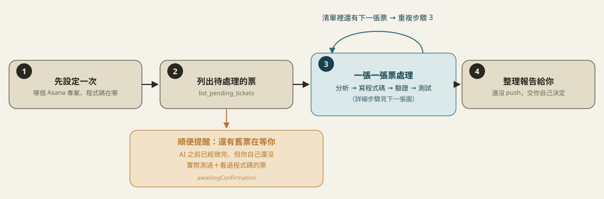
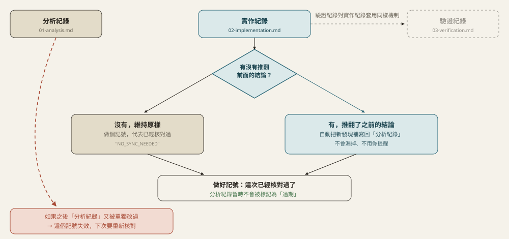
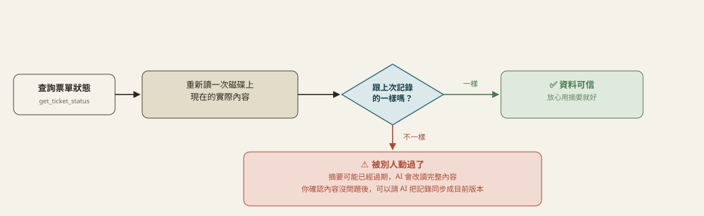
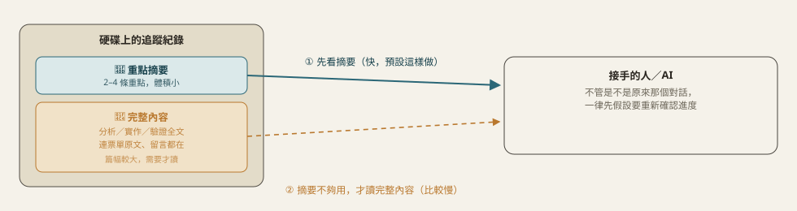
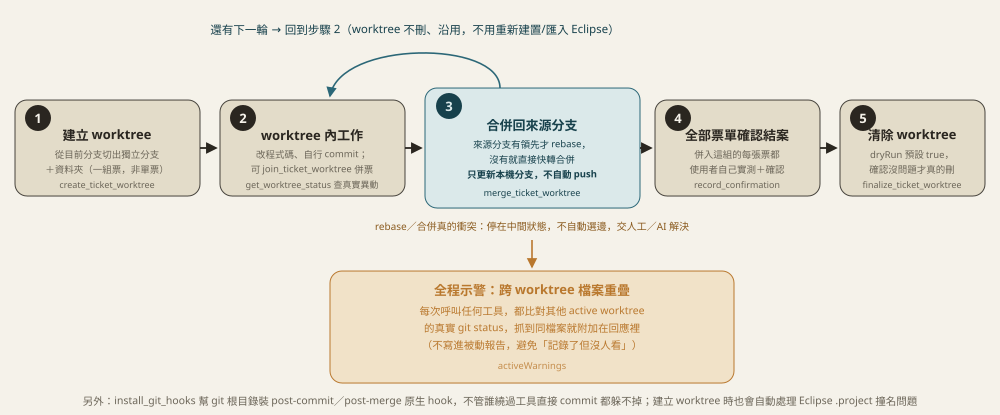

# dev-pipeline-mcp

獨立的 MCP server，讓**任何**支援 MCP 的 AI/host（不限 Claude Code）都能驅動「Asana 票單 → 分析師 → 工程師 → 驗證師」這條自動處理流程。

## 這個 MCP 不會自己思考

跟內建呼叫某家模型 API 的「agent MCP」不同，這個 server **完全不呼叫任何 LLM**、不需要模型 API key。它只做兩件事：提供工具（抓票單、讀寫程式碼、跑 shell、管理追蹤紀錄）跟提供角色說明（`get_pipeline_overview`／`get_role_prompt`）。實際的分析、寫程式碼、驗證判斷，都是**連上這個 MCP 的那個 AI 自己的模型**在做——接 Claude、GPT、Gemini 都能用。

## 安裝與設定

```bash
npm install
npm run build
```

這個 MCP 是「橋接」設計，本身沒有 Asana token、不自己讀寫 SVN，轉呼叫兩個既有 MCP；「Asana 專案↔目錄」「git 版控根目錄」這兩份登記表、`get_recent_commits`（讀 git log）是自己本機維護/實作的：

| 依賴 | 用途 |
|---|---|
| [`asana-mcp`](../asana-mcp) | 抓 Asana 票單/看板/留言（唯讀） |
| [`svn-mcp`](../svn-mcp) | SA/SD 規格文件在 SVN 上的瀏覽/讀取（唯讀） |

啟動時會自動把這兩個當子行程啟動，**必須先各自 `npm install && npm run build` 過**。

> 這個專案原本還借用一個獨立的 `spec-pipeline-mcp` 提供 `get_recent_commits`，2026-09-09 已經把這個功能收回本專案自己實作（`git-utils.ts`），`spec-pipeline-mcp` 這個獨立 MCP／它專屬的「分析規格檔案」觸發流程已經整個淘汰——那類「先建置案再補規格」的情境，改走本專案既有的 Asana 票單流程即可（規格一律讀 SVN，不用再本機同步一份）。

<details>
<summary>環境變數</summary>

| 變數 | 說明 | 預設值 |
|---|---|---|
| `ASANA_MCP_PATH` | asana-mcp 的 `dist/index.js` 絕對路徑 | `../asana-mcp/dist/index.js` |
| `SVN_MCP_PATH` | svn-mcp 的 `dist/index.js` 絕對路徑 | `../svn-mcp/dist/index.js` |
| `ASANA_PIPELINE_DATA_DIR` | 本機輕量資料（票單索引/登記表/`file-write-state.json`）存放目錄；票單內容本身在各專案的 `.asana-pipeline/` 底下 | `./data` |

`svn-mcp` 被當子行程啟動會繼承父行程環境變數，所以 `SVN_API_BASE`/`SVN_CONNECTION_ID` 只要帶在啟動 `dev-pipeline-mcp` 的 `env` 裡就生效。Asana token 設在 `asana-mcp` 那邊。

</details>

### 建議：在你自己使用的 AI 工具的全域規則檔加一條規則

`.asana-pipeline/` 底下的追蹤檔案有機會被使用者或另一個沒有走這條 pipeline 的 AI 直接用一般 Edit/Write 手動改到——這種情況這個 MCP 完全不知情（見下方「外部修改偵測」），而且**只有在有人明確呼叫 `get_ticket_status`/`read_ticket_artifact` 時才會被抓到，不會主動通知**。

比較可靠的做法是把這條規則放進**你自己使用的 AI 工具的全域規則檔**（不限 Claude Code）——概念上要挑那種「不管在哪個專案目錄開新 session 都會被自動讀到」的設定檔，涵蓋範圍才會比只寫在這個 MCP 的 prompt 裡（只有真的呼叫 `get_pipeline_overview`/`get_role_prompt` 才讀得到）廣。不同 AI 工具這份檔案的名稱、位置都不一樣，要自己對應調整，例如：

| AI 工具 | 對應的全域規則檔 |
|---|---|
| Claude Code | `~/.claude/CLAUDE.md` |
| 其他支援全域系統提示/規則檔的 AI CLI | 該工具說明文件裡「每次啟動都會自動載入」的那份設定檔——沒有的話就只能退回寫在專案層級 |

以 Claude Code 為例，建議加一段類似：

```markdown
## Asana Pipeline 追蹤檔案同步規則

任何專案目錄下只要有 .asana-pipeline/ 資料夾，一律適用：
- 直接用 Edit/Write 改了裡面的 01/02/03/04-*.md（沒透過 write_ticket_artifact）之後，
  接著呼叫 resync_ticket_artifact({ taskGid, filename }) 同步雜湊記錄。
- 不確定追蹤狀態是不是最新的，先呼叫 get_ticket_status 看 external_changes，
  任一個 _externally_modified 是 true 就重新讀全文，不要只信快取摘要。
```

用別的 AI 工具，把上面這段規則內容原封不動搬過去、放進它自己對應的全域規則檔即可——規則本身（呼叫哪個工具、看哪個欄位）是這個 MCP 的行為，跟用哪個 AI 無關，只有「放在哪份檔案」這件事因工具而異。

這終究是提醒 AI 自己記得做，不是工具層級的強制——真正的安全網是「外部修改偵測」那組機制本身（見下方），這段只是提高被看到、被處理的機率。

### 一次性設定（每個 Asana 專案通常只問一次）

| 工具 | 設定什麼 |
|---|---|
| `resolve_default_project` / `register_default_project` | 今天要看哪個 Asana 專案 |
| `resolve_project_dir` / `register_project_dir` | 對應哪個本機/伺服器程式碼目錄 |
| `resolve_sasd_config` / `register_sasd_config` | SA/SD 規格放哪、模式為何（見下表） |
| `resolve_legacy_test_profile` / `register_legacy_test_profile` | 這個專案要不要套用測試工程師說明書的「老舊系統測試」章節（JDK6+舊IE這類，預設 `false`，只有使用者明確告知才登記為 `true`） |
| `resolve_test_capability` / `register_test_capability` | 這個專案的工程師階段能不能寫自動化測試、用哪套工具鏈（`modern`/`legacy_junit4`/`none`）。跟上面 `legacy_test_profile` 是不同軸向——那個管「測試工程師手動測試要不要套老 IE 章節」，這個管「工程師能不能寫 JUnit/Jest 自動化測試」，一個專案可能兩者都成立，也可能只成立一個 |
| `resolve_git_roots` / `register_git_roots` | 前後端各自的 git 版控根目錄 |

### SA/SD 規格四種模式

| 模式 | 適用情境 | 規則 |
|---|---|---|
| `external` | 規格是客戶/第三方產的 | 只能參考，不能建議修改 SD，只調整程式碼配合 |
| `self` | 規格是自己團隊產的 | 可在報告裡建議修改段落，但不寫回 SVN（唯讀） |
| `self-generated` | 沒有既有規格，AI 自己維護 | 唯一會多走 `sd_drafted` 規格確認關卡的模式：「規格撰寫者」角色產出草稿寫進 `sdOutputPath`，使用者 `record_spec_confirmation` 確認過才能繼續往下走。額外要登記 `specOrder`（見下） |
| `unregistered` | 不登記，逐票詢問 | 唯一每張票都要單獨問「有沒有 SD」的模式 |

`self-generated` 底下還要多決定一個 `specOrder`，決定「規格草稿」關卡出現在流程的哪個位置：

| specOrder | 順序 | 說明 |
|---|---|---|
| `spec_first`（原本唯一支援的順序） | 分析 → **規格定案** → 寫程式碼 → 驗證 | 規格撰寫者先依分析師的結論產出草稿，使用者確認過，工程師才動手寫程式碼——規格先定案，程式碼才動工 |
| `code_first` | 分析 → 寫程式碼 → **規格反推** → 驗證 | 工程師先依分析師的結論直接寫程式碼，規格撰寫者再依實際改動反推整理成一份草稿，一樣要使用者確認過，票單才能推進到驗證完成 |

兩種順序共用同一套 `sd_drafted`/`spec_confirmation` 機制——差別只在這個確認關卡卡在「寫程式碼之前」還是「寫程式碼之後」，`advance_ticket_stage` 本身不需要知道 `specOrder` 是什麼，只要看票單目前是不是卡在 `sd_drafted` 又還沒確認，就會擋下推進到下一步（`implemented` 或 `verified`，視卡住的時間點而定）。

---

## 流程圖解

> 想看白話版、非技術人員也看得懂的完整手冊：clone 這個 repo 後用瀏覽器打開 [`docs/MANUAL.html`](docs/MANUAL.html)（GitHub 網頁只顯示 `.html` 原始碼，不會渲染）。下面是給工程師/AI 看的技術版，每個小節預設收合，點開才看得到細節。

<details>
<summary>每次執行的迴圈</summary>



`list_pending_tickets` 每次呼叫都會多回傳一份清單：`awaitingConfirmation`（AI 驗證師判過 `PASS`、Asana 內容也沒再變過，但**使用者自己還沒實際測過＋審視程式碼品質**的票）。這份清單每次都要主動列給使用者看（不因為這次是來處理別的新票就略過），直到每一張都呼叫 `record_confirmation` 表態，才會從清單消失。

</details>

<details>
<summary>單張票的狀態機</summary>

![票單狀態機：new 到 snapshot 到 project_dir_confirmed 到 analyzed 到 implemented 到 verified 到 tested 依序推進，只會往前走；自維護規格的專案會多一關 sd_drafted 規格確認，依 specOrder 設定出現在 analyzed 之後（spec_first，卡在推進到 implemented 之前）或 implemented 之後（code_first，卡在推進到 verified 之前）；verified 或 tested 且 FAIL 時依 rootCause 自動路由回分析師或工程師重跑，兩階共用同一組 consecutive_fail_count，達到門檻才停下來問使用者；tested 階段裡 AI 沒把握精確判定的測試項目不算 FAIL，只會列進待確認清單；tested 且 PASS 之後若偵測到內容雜湊改變，會觸發警示標記 needs_reanalysis，verdict、confirmation 一併清空，逼下一輪重新從分析師開始；內容沒再變的話則落入待使用者確認狀態，confirmed:false 會導向跟 FAIL 一樣的根因分流，直到 record_confirmation 帶 confirmed:true 才進入已結案](docs/img/ticket-state-machine.svg)

七格 `stage`（灰／綠）只會往前走，不會跳過也不會倒退；`snapshot` 下的灰圈是省 token 捷徑（內容雜湊沒變就不重寫、不回全文）。最後一格 `tested`（測試工程師，見下方「測試工程師階段」一節）是 `verified` 判 PASS 之後、人類最終確認之前新增的一關，每張票都會經過，套用哪些檢查項目由 AI 依這張票的改動內容自己判斷。紅卡有兩張：右上角是內容變動的例外——`tested` 且 `PASS` 之後若偵測到 Asana 內容真的變了，會亮起 `needs_reanalysis` 旗標逼下一輪重新分析、`verdict`、`confirmation` 一併清空，但 **`stage` 本身不會倒退**，仍顯示 `tested`；下方較寬那張是 **`verdict: FAIL` 的根因分流**——`verified` 或 `tested` 任一階段 `advance_ticket_stage` 設 `FAIL` 時必填 `rootCause`（`"analysis"`/`"implementation"`），AI 依此自動跳回分析師或工程師重跑，不用停下來問使用者，兩階共用同一組 `consecutive_fail_count`，由工具機械式維護（FAIL 累加、PASS 歸零），達到門檻（`needs_human_review`，預設連續 3 次）才停下來問。`tested` 階段裡 AI 沒把握精確判定的測試項目（`needs_manual_check`）不算 FAIL，不影響這裡的路由，只會列進 `manualActions` 帶到黃卡那一關給使用者。

**自維護規格的專案（`sdMode: "self-generated"`）會多一關 `sd_drafted` 規格確認**，出現的時機依這個專案登記的 `specOrder` 而定：`spec_first`（原本唯一支援的順序）卡在 `analyzed` 之後、`implemented` 之前——規格先定案，工程師才動手寫程式碼；`code_first` 卡在 `implemented` 之後、`verified` 之前——工程師先直接寫程式碼，規格撰寫者再依實際改動反推補一份草稿。兩種順序共用同一個 `spec_confirmation` 欄位跟同一套擋下邏輯，`advance_ticket_stage` 只看「目前是不是卡在 `sd_drafted` 又還沒確認」就會擋下，不需要額外查 `specOrder`。

黃卡是另一個獨立軸向：`tested` 且 `PASS`、內容也沒再變的情況下，票單會先落入「待使用者確認」——**`verdict` 是 AI（驗證師或測試工程師）自己判的結論，不等於真正結案**。使用者呼叫 `record_confirmation({ taskGid, confirmed: true })` 之後，才會真正進入綠卡「已結案」。**`confirmed: false`（回報有問題）會把 `verdict` 重設回 `null`、標記 `humanRejected: true`，重新套用跟上面 `FAIL` 完全一樣的根因分流機制**，不是留給人工事後自己判斷、也不是另開一條獨立流程。這整段狀態轉換只落在本地追蹤檔案裡，**不會回寫到 Asana 本身**——`asana-mcp` 刻意設計成唯讀，Asana 上要不要標記完成一律交由使用者自己手動處理。

</details>

<details>
<summary>工程師階段：要不要補自動化測試（<code>resolve_test_capability</code> / <code>register_test_capability</code>）</summary>


跟 `sdMode`/`specOrder` 一樣是**專案層級設定**，第一次進到這個專案的工程師階段（`found: false`）才會問使用者一次，問完登記之後同一個專案不用每張票再問。三種模式裡，`legacy_junit4` 如果建置設定還沒加測試依賴，AI 會先問使用者要不要由它加上去，不會擅自改 `pom.xml`/`build.gradle`；`none` 是刻意的選擇（例如上銀，JDK6/7且暫不引入測試依賴），不代表哪個環節沒做好。

</details>

<details>
<summary>測試工程師階段（<code>tested</code>）</summary>

`verified` 判 PASS 之後、人類最終確認之前新增的一關，每張票都會經過。跟驗證師（核對規格/程式碼是否一致）不同——測試工程師核對的是「這段程式碼在各種情境下實際跑起來對不對」，依 `get_test_engineer_guide` 取得的測試工程師說明書（通用測試框架／報表測試／老舊系統測試三章）跑情境測試。**如果 `resolve_test_capability` 回傳的 `mode` 不是 `none` 且工程師這輪真的補了測試，測試工程師會優先重新跑一次那些測試當作情境測試的交叉核對證據**——測試涵蓋到的分支直接算 `verified_pass`/`verified_fail`，沒涵蓋到的（需要真的瀏覽器操作、真的資料庫特定狀態才能觸發）才需要另外判斷是不是只能列 `needs_manual_check`。

**每個測試項目自己標記結果類型，不是整張票綁一個結論**：AI 真的有辦法精確判定的項目（例如跑得動的邊界值測試、報表欄位/公式逐欄比對、用指定版本實際編譯）標記 `verified_pass`/`verified_fail`，只有 `verified_fail` 才影響整張票的 `verdict`、觸發跟驗證師一樣的根因自動打回；AI 沒有精確依據、只能提醒使用者的項目（例如報表版面視覺比對、老 IE 實際渲染）標記 `needs_manual_check`，不卡關，透過 `manualActions` 帶到人類最終確認那一關。

**報表／老舊系統兩章是不是套用，AI 依這張票改動的檔案自己判斷**，不用整份說明書每次全套用。老舊系統章節額外多一層：只有 `resolve_legacy_test_profile` 回傳 `true` 才套用——這是專案層級的布林設定（`register_legacy_test_profile`），預設 `false`，只有使用者明確告知「這個專案是 JDK6+舊IE 這類環境」才登記為 `true`，AI 不會自己依程式碼特徵猜測。

</details>

<details>
<summary>01/02/03/04 互相同步</summary>



跟上一張圖是不同軸向的雜湊比對：那張管「票單原文 vs 追蹤系統」，這張管「01/02/03/04 四份文件彼此」。`write_ticket_artifact` 寫 02/03/04 時 `syncNote` 是必填欄位（可以填 `NO_SYNC_NEEDED`，但不能不填），逼呼叫端每次都對「要不要同步」做一次明確判斷——這是這條 pipeline 曾經反覆修正十幾輪、分析文件完全沒跟上、全靠使用者事後肉眼發現的問題換來的強制檢查。

</details>

<details>
<summary>外部修改偵測</summary>



跟上一張「01/02/03/04 互相同步」圖是不同軸向的比對：那張比的是「兩份都是這個 MCP 自己以前記錄的雜湊」彼此對不對得起來（`sync_flags`）；這張比的是「這個 MCP 記錄的舊雜湊」跟「磁碟上現在真正的內容」對不對得起來（`external_changes`）——**只有這組比對才抓得到「使用者或別的沒走這條 pipeline 的 AI，直接手動編輯了追蹤檔案」這種情況**，因為 `sync_flags` 用的兩個雜湊都只在呼叫 `write_ticket_artifact` 時才會更新，繞過它就不會被更新到，拿兩個「一樣沒被更新過」的舊值互相比，永遠看起來「一致」。

`get_ticket_status` 每次呼叫都會當場重新讀一次 01/02/03/04 現在的內容、重新算雜湊，回傳裡的 `external_changes.{analysis,implementation,verification,test}_externally_modified` 任一個是 `true`，就代表對應那份文件被外部改過——這個工具不會自動修正，只負責誠實回報；確認過修改沒問題、想把雜湊記錄同步回目前內容，另外呼叫 `resync_ticket_artifact`。這個機制不需要任何人記得做什麼，純粹是被動的、每次查詢都會自己重算的偵測，不像「叫 AI 記得同步」那樣不可靠。

</details>

<details>
<summary>待人工處理清單（<code>PENDING_HUMAN_ACTIONS.html</code>）</summary>


過去「這張票需要你確認」「這個 SQL 只能你手動執行」這類提醒，只會在當次聊天回覆裡講一次——換個 session、關掉對話視窗，這份清單就沒了，只能重新問 AI 才會再看到一次。

現在 `list_pending_tickets({ projectGid, projectName, sectionFilter? })` **只要帶 `projectName`**，每次呼叫都會把當下算出來的六類「需要人工處理」項目整份覆寫進 `<projectDir>/.asana-pipeline/<projectName>/PENDING_HUMAN_ACTIONS.html`——**不是純文字，是一份可以互動的網頁**，其中四類直接在頁面上點就能生效，不用回頭問 AI：

1. **待確認規格草稿**（可互動 ✅／❌）——只有 `sdMode: "self-generated"` 的專案會出現：規格撰寫者已產出草稿，等你確認可以開始寫程式碼，或打回並簡短說明哪裡要改。按鈕即時呼叫 `record_spec_confirmation`。
2. **待確認**（可互動 ✅／❌）——AI 驗證師／測試工程師都判過了，等你自己實測＋審視程式碼品質；按「沒問題，結案」或「有問題，回報」（要填一句原因）即時呼叫 `record_confirmation`。
3. **卡住需要你介入**（唯讀）——連續 `FAIL` 已經達到門檻（`needs_human_review`），AI 不會再自動重跑。這個狀態沒有對應的「標記已處理」按鈕，**但不要只跟 AI 說「繼續處理」**——那很可能只是用同一套已經失敗 3 次的邏輯再試一次，變成失敗→問你→你說繼續→再失敗的空轉。先看清楚 AI 列出的這幾輪 FAIL 理由，給出新的判斷或方向，AI 才會（也才應該）繼續往下走；之後 PASS 會自動清除這一項。
4. **Asana 內容已被異動，待重新確認**（可互動 ☑️，2026-09-17 起）——先前已經處理過（甚至已經 PASS）的票單，Asana 上的內容後來又被改過（用 `modified_at`／`needs_reanalysis` 判斷），不能因為之前處理過就跳過。勾選「請 AI 優先處理」會呼叫 `request_reanalysis({ taskGid })`，寫入 `human_requested_reanalysis` 旗標——**這個勾選只是標記請求，bridge 沒有 LLM 能力，不會、也不能立即觸發任何分析**，要等下一個呼叫 `list_pending_tickets` 的 AI（任何 session、任何廠牌，見 `tickets[].humanRequestedReanalysis`）主動對這張票呼叫 `get_ticket_snapshot`，旗標才會被清掉。已經勾過的項目會顯示成唯讀提示，避免重複勾選。這一項會在 AI 真的重新分析這張票之後自動消失。
5. **需要你手動處理的事項**（可互動 ☑️）——來自 `write_ticket_artifact` 寫 02/03/04 時**必填**的 `manualActions` 參數（可以是空陣列，代表明確確認這次沒有）。典型例子是「已產出 SQL，只能由你到 Database 工具手動執行」——這類一次性提醒過去只寫在全文或聊天視窗裡，換個 session、或沒仔細重讀全文就會被漏掉，現在強制工程師/驗證師/測試工程師每次都要明確宣告一次。**勾選框即時呼叫 `resolve_manual_action({ taskGid, filename, action })`，精準移除那一項**，不用整份重新宣告，也不用回頭問 AI。`manualActions` 只能寫技術性描述，寫入前會自動掃描是否夾帶完整 SQL 語句全文或憑證/連線字串，抓到會直接拒絕寫入（見 `detectSensitiveManualActions`）。
6. **Git 尚未 commit 的變更**（唯讀）——對每個已登記的 git 版控根目錄實際跑一次 `git status --porcelain`，再用每張票 `manualActions` 裡點名「尚未 commit」的檔名去篩選、依票單分組，只列出「git 真的還沒 commit、又有票單認領」的檔案；跟這次 pipeline 無關的其他未 commit 檔案整份省略。還沒呼叫過 `register_git_roots` 的專案，這一項會顯示「還沒登記」。commit 之後這一項會自動消失，沒有對應的按鈕——那本來就是你自己跑 `git commit` 的事。

**互動按鈕要先有本機 HTTP bridge 在跑才會生效**（2026-09-17 起預設跟著 stdio 版 MCP 入口 `dist/index.js` 一起自動啟動——任一個 Claude Code session 連上 `dev-pipeline-mcp` 就會自動帶起，預設監聽 `http://127.0.0.1:8097`，可用 `DEV_PIPELINE_MCP_HTTP_PORT`/`DEV_PIPELINE_MCP_HTTP_HOST` 環境變數覆寫；同一台機器上多個 session 各自的行程搶同一個 port 時只有第一個會真的綁定，其餘安靜略過，不影響各自的 MCP 功能）。想繼續用舊版「獨立長駐、完全不開 Claude Code 也能用」的模式，仍然可以在 `dev-pipeline-mcp` 目錄下手動執行 `npm run start:http`（跟 svn-mcp 的 `dist/http-server.js` 同一個模式）。頁面一載入就會偵測 bridge 在不在：連得到，互動元件正常可用；連不到，頁面頂端會出現黃色提示條，所有勾選框/按鈕整批停用（內容仍然是最新的，純唯讀），不會讓你以為勾了卻其實沒生效。bridge 直接重用 stdio 版工具背後同一組函式，跟真正呼叫 `resolve_manual_action`/`record_confirmation`/`record_spec_confirmation`/`request_reanalysis` 走同一條資料路徑、同一套驗證規則（例如還沒跑到 `tested` 階段就想結案一樣會被擋下），不是另外做一套繞過驗證的捷徑。只接受本機呼叫（bind `127.0.0.1`），沒有身分驗證，信任邊界是「只有這台機器上的人碰得到」。

這份檔案不需要任何人記得手動維護——它是 `list_pending_tickets`（以及任何會改動票單狀態的工具）呼叫的**副作用**，不是一個容易被忘記呼叫的額外步驟。檔案本身會被整份覆寫，不要手動編輯 HTML 原始碼。

</details>

<details>
<summary>換 session／換 AI 接手</summary>



追蹤狀態落地在磁碟，不是活在對話記憶裡。每個角色開始前先看 `get_ticket_status` 摘要，只有漏掉關鍵細節才多花一次 tool call 呼叫 `read_ticket_artifact` 讀全文。

</details>

<details>
<summary>多票單／多 AI 併行處理（worktree 隔離）</summary>



同一台機器上常態讓好幾個 AI/session 併行處理不同票單，卻共用同一份 git 工作目錄，很容易出現「這輪改了哪些檔案」彼此看不到、甚至互相覆蓋的問題。這組工具用 [git worktree](https://git-scm.com/docs/git-worktree) 把每組票單隔離到獨立的資料夾＋分支：

- **一個 worktree 綁定一組票號，不是單張票**——`create_ticket_worktree` 建立，同一次改動要合併的另一張票用 `join_ticket_worktree` 併進來。worktree 資料夾建在 git 根目錄的上一層 `.worktrees/<票號>/`，會自動處理舊式 `maven-eclipse-plugin` 專案的 `.project` 撞名問題（`<name>` 標籤跟主目錄的專案同名，改掉並用 `git update-index --skip-worktree` 蓋住，不會出現在 git status，也不會被合併回主分支）。
- **建立一次、跨輪次沿用，不是每輪重開**——`get_worktree_status` 查真實改動狀態（不靠 AI 自己宣告哪些檔案動過）跟是否需要 rebase；`merge_ticket_worktree` 判斷來源分支有沒有領先（有才 rebase，沒有直接快轉）、合併回來源分支，**只更新本機分支，絕不自動 push**，worktree 本身不會被刪，下一輪直接接著用。真的衝突時兩者都不自動選邊，停在中間狀態交給人工/AI 解決。
- **`abandon_ticket_round`** 安全 commit 目前異動後把這個 worktree 標記中斷，不刪除，當備份留著。
- **`finalize_ticket_worktree`** 要求併入的每張票都已經 `record_confirmation({confirmed:true})` 才能清除，**`dryRun` 預設 `true`**，看過模擬結果沒問題再帶 `false` 真的執行。
- **`list_worktrees`** 列出所有登記中的 worktree，並跟 git 自己的 `worktree list` 交叉比對，抓出紀錄跟實際狀態對不起來的項目（例如資料夾被人手動刪掉）。

**跨 worktree 檔案重疊示警（`activeWarnings`）**：每次呼叫任何 `dev-pipeline-mcp` 工具，回應都會比對其他 active worktree 目前真實改到的檔案，抓到同一個檔案被兩個 worktree 同時碰到就附加在回應裡——刻意不寫進 `PENDING_HUMAN_ACTIONS.html` 那份被動報告，避免「記錄了但沒人看」。**判斷依據是 `git status --porcelain`（還沒 commit 的異動）跟「相對 `baseCommit` 的 diff」（已經 commit 但還沒呼叫 `merge_ticket_worktree` 合併回去的異動）兩者的聯集**——只看前者的話，這輪一旦 commit 起來但還沒合併，工作目錄會變乾淨，重疊偵測會完全瞎掉，這是實際測試後修正過的地方。

**⚠️ 重要：`install_git_hooks`（防繞過核心防線）**——如果直接用 `Edit`/`Write` 或任何不經過這組工具的方式改動受追蹤專案的檔案再自己 `git commit`，`activeWarnings` 的判斷依據跟稽核紀錄都會失準。**不論你用的是哪一個 AI／CLI（Claude Code、其他工具、或人手動操作），只要會直接改動受追蹤專案的檔案，都應該對這個專案的 git 根目錄呼叫一次 `install_git_hooks`**——它會裝 `post-commit`/`post-merge` 這兩個 git 原生 hook（透過 `core.hooksPath` 指到這個 MCP 自己管理的共用資料夾，不會寫進客戶專案版控），不管誰用什麼方式 commit/merge 都躲不掉，即時讓 `activeWarnings` 快取失效重算，並留一筆稽核紀錄在 `data/git-hook-events.log`。**它的邊界**：git hook 只認得出「真的 commit/merge 了」這件事，如果檔案編輯完之後遲遲不 commit，git hook 完全看不到——這不是 bug，是任何 git 原生 hook 天生的觀察範圍（它掛在 git 事件上，不是檔案系統事件上）。這個邊界不影響 `activeWarnings` 本身的即時性（它靠自己 10 秒 TTL 的快取＋每次都重新查一次即時狀態，不是靠 git hook 通知才更新），只會讓 `git-hook-events.log` 這份稽核紀錄裡少一筆——沒 commit 就沒有 commit 事件可記，這點無解。

**輔助層：針對「正在用的 AI 工具」各自設計的 `PostToolUse` 式 hook**——如果想補上「編輯完但可能遲遲不 commit」這段空窗的即時可見度（不等 10 秒 TTL），概念上要對「你現在實際用的那個 AI/CLI」各自設計對應的 hook，**不限定 Claude Code**——不同 AI 工具的 hook 機制、設定位置、觸發時機都不一樣，沒辦法用同一份設定套用到所有工具。下面以 Claude Code 為例，示範可以在專案的 `.claude/settings.json`（或使用者全域設定）加這段，`Edit`/`Write`/`Bash`/`PowerShell` 之後就會主動通知 bridge，換其他 AI/CLI 要照它自己的 hook 語法重寫等效邏輯：

```json
{
  "hooks": {
    "PostToolUse": [
      {
        "matcher": "Edit|Write|Bash|PowerShell",
        "command": "node -e \"try{const{execSync}=require('child_process');const http=require('http');const root=execSync('git rev-parse --show-toplevel',{cwd:process.cwd()}).toString().trim();const port=process.env.DEV_PIPELINE_MCP_HTTP_PORT||8097;const host=process.env.DEV_PIPELINE_MCP_HTTP_HOST||'127.0.0.1';const body=JSON.stringify({gitRoot:root,event:'posttooluse'});const req=http.request({host,port,path:'/git-hook-event',method:'POST',headers:{'Content-Type':'application/json','Content-Length':Buffer.byteLength(body)}});req.on('error',()=>{});req.end(body);}catch(e){}\"",
        "description": "通知 dev-pipeline-mcp 立即讓 activeWarnings 快取失效"
      }
    ]
  }
}
```

**這段範例刻意不讀 hook 傳入的 stdin**（改用 `process.cwd()` + `git rev-parse --show-toplevel` 自己算出 gitRoot）——在 Windows 上，`Edit`/`Write` 這個 matcher 讀 stdin 曾經實測完全不可靠（hook 像沒執行一樣，見內部記憶 `feedback_windows_hook_stdin`），所以完全繞開這個依賴。

**要注意這裡分兩層，不要混為一談**：「補上編輯完但還沒 commit 這段空窗的可見度」是通用概念，任何 AI/CLI 只要自己有 hook 機制都可以做到；**但上面這份 `.claude/settings.json` 設定是 Claude Code 專屬的語法，只有跑在 Claude Code 底下才會生效**——用別的 AI/CLI 或人手動編輯不會觸發*這份設定*，但不代表那些工具就做不到同樣的事，只是要照各自的 hook 語法另外寫一份等效邏輯。也正因為這個輔助層天生就是「每個 AI/CLI 要各自設定，沒設定就沒有」，才會被定位成錦上添花的輔助層，而不是核心防線——核心防線永遠是 `install_git_hooks` 裝的 git 原生 hook（跟用哪個 AI/CLI 無關，git 一動就會觸發）。

</details>

---

## 追蹤目錄放在哪裡

建在**目標程式碼專案自己的目錄**，不是這個 MCP 的安裝目錄：

```
<projectDir>/.asana-pipeline/<Asana 專案全名稱>/<票號>/<子票號>/...   （子任務巢狀，層數不限，自動偵測）
```

分享/交接這個工具本身不會夾帶任何客戶票單內容——內容全部留在各專案目錄。第一次建立追蹤目錄時會在該專案 `CLAUDE.md` 附加一段說明（不覆蓋既有內容）。`data/tickets-index.json` 只存 `{ taskGid: 目錄路徑 }` 對照表，不含票單內容。

---

## 提供的工具

<details>
<summary>展開完整工具清單（54 個）</summary>

| 工具 | 用途 |
|---|---|
| `get_pipeline_overview` | 取得整條流程說明（第一步一定先呼叫） |
| `get_role_prompt` | 取得分析師／規格撰寫者／工程師／驗證師／測試工程師其中一個角色的職責說明（`spec-writer` 只有 `sdMode: "self-generated"` 才需要；`tester` 每張票都會經過，是 `verifier` 判 PASS 之後、人類最終確認之前新增的一階） |
| `resolve_default_project` / `register_default_project` | 查詢/登記「今天的問題單」預設 Asana 專案 |
| `list_pending_tickets` | 列出某個 Asana 專案尚未處理完成的票單；附上 `awaitingConfirmation`（AI 已 PASS、還卡在使用者自測這關的舊票）、`needsHumanReview`（連續 FAIL 已達門檻）、`contentChangedList`（先前處理過、Asana 內容後來又被改過**或使用者主動要求重新確認**的票）、`manualActions`（有待使用者手動處理事項的票），一般待處理清單裡也會標記 `humanRejected: true`（人類打回、需比照 AI 驗證師 FAIL 處理的票）、`humanRequestedReanalysis: true`（使用者在網頁上勾了「請 AI 優先處理」，這次批次一定要處理，見 `request_reanalysis`）。**帶 `projectName` 會把這六類整份寫進互動網頁 `PENDING_HUMAN_ACTIONS.html`**（見下方說明） |
| `get_ticket_snapshot` | 抓票單內容＋留言，寫入追蹤檔案；子任務自動偵測（讀 Asana `parent` 欄位） |
| `relocate_ticket_project` | 修正 `get_ticket_snapshot` 第一次呼叫 `projectName` 傳錯時，這張票（連同巢狀子任務）的本機追蹤資料夾要一併搬到正確的專案名稱底下；只改本機資料夾標籤，不會也不能改 Asana 上這張票實際所屬的專案 |
| `get_ticket_activity` | 取得票單完整活動時間軸（留言＋系統事件＋附件，依時間排序）；使用者說「查看測試員回報的測試狀況」時用這個 |
| `download_ticket_attachment` | 下載某個附件到本機暫存檔（`attachmentGid` 來自 `get_ticket_activity`） |
| `resolve_project_dir` / `register_project_dir` | 查詢/登記 Asana 專案 → 程式碼目錄 |
| `resolve_sasd_config` / `register_sasd_config` | 查詢/登記 SA/SD 規格設定；`external`/`self` 會真的驗證 SVN 連線才登記成功；`self-generated` 還要額外登記 `specOrder`（`spec_first`/`code_first`） |
| `resolve_legacy_test_profile` / `register_legacy_test_profile` | 查詢/登記這個專案要不要套用測試工程師說明書的「老舊系統測試」章節（JDK6+舊IE這類，預設 `false`，只有使用者明確告知才登記為 `true`，不自動偵測） |
| `resolve_test_capability` / `register_test_capability` | 查詢/登記這個專案工程師階段能不能寫自動化測試、用哪套工具鏈（`modern`/`legacy_junit4`/`none`）；測試工程師階段會依這個設定決定要不要重跑工程師補的測試當交叉核對證據 |
| `read_project_sd_doc` / `write_project_sd_doc` | 讀寫「自維護」SD 文件（`self-generated` 專用），寫在 `sdOutputPath` 真實本機檔案 |
| `get_sd_spec_template` / `get_sd_spec_versioning_rules` | SD 規格撰寫範本／版更規範，寫入前應先呼叫其中之一 |
| `get_test_engineer_guide` | 取得測試工程師說明書：通用測試框架／報表測試／老舊系統測試三章檢查清單，供設計測試案例、跑手動/情境測試時查，跟驗證師角色的規格/程式碼交叉核對是不同用途 |
| `svn_list_connections` / `svn_test_connection` | 轉呼叫 svn-mcp，列出/測試 SVN 連線 |
| `svn_browse` / `svn_cat` / `svn_doc_images` / `svn_log` | 轉呼叫 svn-mcp 讀 SVN 上的規格（唯讀），一律讀遠端不讀本機 checkout |
| `get_recent_commits` | 查某目錄最近的 git commit |
| `read_project_file` / `write_project_file` / `list_project_dir` / `search_project_text` | 讀寫/搜尋專案檔案（限 `projectDir` 範圍內）；偵測外部修改，見下方安全限制 |
| `resolve_git_roots` / `register_git_roots` | 查詢/登記專案目錄實際的 git 版控根目錄（可前後端分開） |
| `run_project_shell` | 跑 shell 指令；git 指令會驗證版控根目錄，見下方安全限制 |
| `get_ticket_status` / `advance_ticket_stage` | 讀取/更新票單追蹤狀態，附 `sync_flags`/`needs_human_review`/`external_changes`（當場重新讀磁碟比對，抓繞過 MCP 的手動修改）；`verdict`（驗證師或測試工程師的結論，兩者共用同一個欄位跟同一組 `consecutive_fail_count`）、`confirmation`（使用者自測＋審視 code）、`verifier_root_cause`（FAIL 根因，供自動路由）是分開的欄位。`verdict: "FAIL"` 時 `rootCause` 必填（`"analysis"`/`"implementation"`），並會機械式維護 `consecutive_fail_count`（FAIL 累加/PASS 歸零）、清空人類確認。`stage` 新增 `"tested"`（`"verified"` 之後、人類最終確認之前） |
| `write_ticket_artifact` / `read_ticket_artifact` | 讀寫追蹤目錄下的分析/實作/驗證/測試檔案；寫 02/03/04 時 `syncNote`/`manualActions` 都必填（`manualActions` 可以是空陣列，04 的話裝測試工程師判不出來、只能列出來提醒人工的 `needs_manual_check` 項目） |
| `resync_ticket_artifact` | 把 01/02/03/04 其中一份檔案「現在磁碟上的實際內容」重新雜湊、寫回 `sync.*_hash`——給直接手動改過追蹤檔案（沒走 `write_ticket_artifact`）之後，用最低成本同步雜湊記錄，不用跑完整流程；也能順便回填舊票的 `manualActions` |
| `resolve_manual_action` | 把某張票單 `manualActions`（02/03/04 皆可）裡「使用者確認已經處理完」的一項移除（文字精確比對），不用整份陣列重新宣告一次 |
| `record_sasd_check` | 記錄這張票有沒有對應 SA/SD；沒呼叫過會擋下 `01-analysis.md` 的寫入 |
| `record_confirmation` | 記錄結案前唯一一關人類確認——使用者自己的實測＋程式碼品質審視結果（`confirmed`/`note`），只能在 `tested` 階段之後呼叫；`confirmed: true` 才會讓票單真正離開 `awaitingConfirmation`、算結案 |
| `record_spec_confirmation` | 記錄「規格草稿定案」關卡的確認結果（僅 `sdMode: "self-generated"`），只能在 `sd_drafted` 階段之後呼叫；`confirmed: true` 才會解鎖 `advance_ticket_stage` 繼續推進——`specOrder: "spec_first"` 解鎖推進到 `implemented`，`"code_first"` 解鎖推進到 `verified`；`confirmed: false` 打回、清空紀錄等重新產出 |
| `request_reanalysis` | 標記某張票「使用者要求優先重新確認」（`human_requested_reanalysis`），2026-09-17 新增。純資料操作，**不會觸發任何實際分析**——旗標會在下一次任何 AI 對這張票呼叫 `get_ticket_snapshot` 時自動清除；你自己呼叫這個工具之後應該直接接著處理這張票，不要把旗標留給別人 |
| `create_ticket_worktree` | 為一組票單建立獨立 git worktree（見「多票單／多 AI 併行處理」），已存在對應 worktree 時冪等回傳既有資訊；自動處理 Eclipse `.project` 撞名問題 |
| `join_ticket_worktree` | 把另一張票單併入既有的 worktree 分組，之後這個 worktree 的合併/清除都要等這些票單全部確認結案 |
| `get_worktree_status` | 查詢 worktree 真實改動的檔案（`git status --porcelain` ＋跟 `baseCommit` 的 diff 聯集，涵蓋已 commit 但未合併的異動）跟來源分支是否領先（決定要不要 rebase） |
| `merge_ticket_worktree` | 需要才 rebase、合併回來源分支（只更新本機分支，不自動 push），worktree 不會被刪，衝突時停在中間狀態不自動選邊 |
| `abandon_ticket_round` | 中斷一輪還沒合併的 worktree 工作：安全 commit 目前異動後標記中斷，不刪除 worktree/分支 |
| `finalize_ticket_worktree` | 併入的票單全部確認結案後清除 worktree 資料夾＋分支；`dryRun` 預設 `true` |
| `list_worktrees` | 列出所有登記中的 worktree，並跟 git 自己的 `worktree list` 交叉比對出對不起來的項目 |
| `install_git_hooks` | 幫 `projectDir` 已登記的 git 根目錄裝 `post-commit`/`post-merge` 原生 hook（防繞過核心防線），詳見「多票單／多 AI 併行處理」一節 |

</details>

## 安全限制

- `run_project_shell` 拒絕 `git push`、`--force`/`-f`、`reset --hard`、`clean`、`checkout --`/`checkout .`、`restore`、`branch -D`；其餘 git 指令正常可用。
- 任何 git 指令執行前會驗證：`projectDir` 必須先 `register_git_roots` 登記過，且指令實際解析到的 repo root 要跟登記的一致，避免在沒有獨立 `.git` 的子目錄誤跑 `add`/`commit`。
- `read_project_file`/`write_project_file`/`list_project_dir`/`search_project_text`/`run_project_shell` 都限制在提供的 `projectDir` 範圍內，跳出範圍的路徑一律拒絕。
- `write_project_file` 會記住自己上次寫入每個檔案的內容雜湊：偵測到外部修改（其他工具/使用者/別的 AI 改過）預設擋下寫入，要帶 `acknowledgeExternalChange: true` 才會覆蓋。
