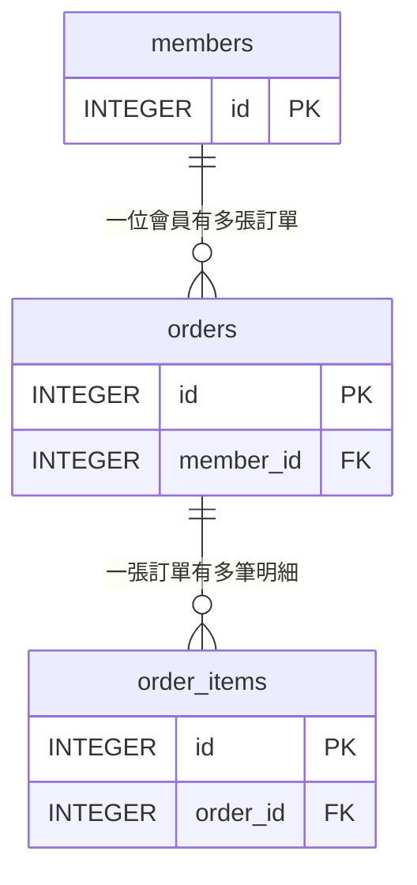
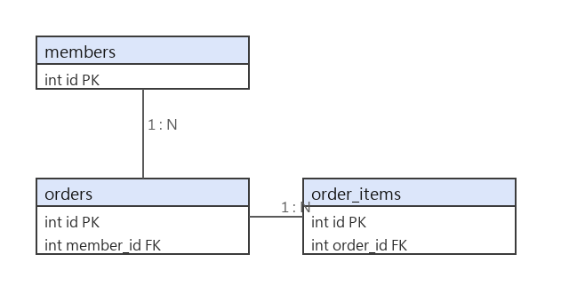

交付檔案：TableSchema/system-er.md

# 系統 ER 圖

## 版本管控歷程

| 版次 | 發行日期 | 修訂說明 | 修訂單位 | 修訂人員 |
| --- | --- | --- | --- | --- |
| 1.0 | 2026/11/10 | 初版 | 示範團隊 | 系統分析師 |

## 系統 ER 圖

```mermaid
erDiagram
    members ||--o{ orders : "一位會員有多張訂單"
    orders ||--o{ order_items : "一張訂單有多筆明細"
    members {
        INTEGER id PK
    }
    orders {
        INTEGER id PK
        INTEGER member_id FK
    }
    order_items {
        INTEGER id PK
        INTEGER order_id FK
    }
```

