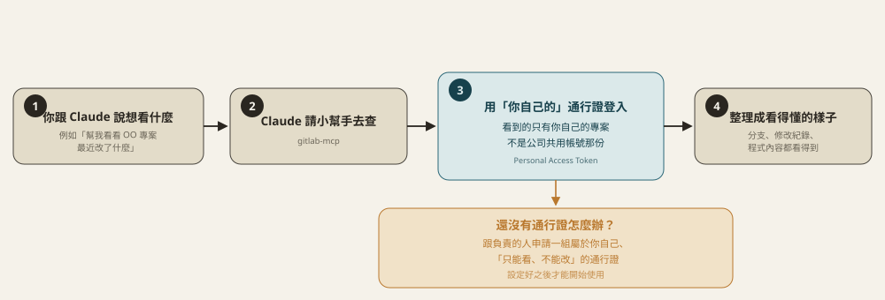
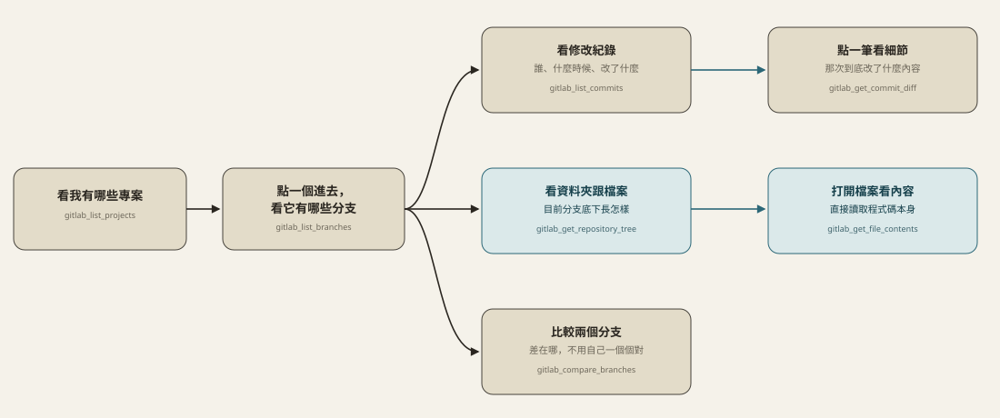

# gitlab-mcp

讓 Claude 幫你查 GitLab 上「屬於你自己」的東西：有哪些專案、專案裡有哪些分支、每個分支改過什麼、程式內容長怎樣。**對 GitLab 本身完全唯讀**，不會幫你改動或刪除任何東西；另外有一組本地端「分支用途標記」工具，會寫入這支 MCP 自己的本地檔案（不是 GitLab 上的東西），用來記錄「哪條分支是個人開發用、哪條是測試機上版、哪條是正式機上版」。

公司原本共用帳號查到的專案是共用視角，不是你自己真正參與的專案。這個小工具用**你自己申請的通行證**登入，看到的才是你個人帳號實際看得到的東西。

## 這是怎麼運作的



## 平常怎麼用

從「看專案」開始，一路點下去就能看到細節：



---

以下是給負責設定的人看的技術細節。

## 設定

在這支 MCP 自己目錄下的 `info/gitlab-connections.json`（已 gitignore，個人專屬，不進版控），是一個**連線清單**，可以同時登記多組帳號/站台（例如公司內部 GitLab 跟 gitlab.com 各一組）：

```json
[
  {
    "id": "gitlab",
    "name": "gitlab",
    "token": "你的 Personal Access Token（scope 只需要 read_api）",
    "baseUrl": "https://gitlab.universalec.com.tw"
  },
  {
    "id": "gitlab2",
    "name": "gitlab2",
    "token": "另一組帳號/站台的 Personal Access Token",
    "baseUrl": "https://gitlab.com"
  }
]
```

- `baseUrl` 每筆都可省略，省略時預設 `https://gitlab.universalec.com.tw`。
- 只設定一筆連線時，所有工具都可以不用帶 `connectionId`，自動用那一筆。
- 設定兩筆以上時，工具呼叫要帶 `connectionId`（值是上面的 `id` 或 `name`，例如 `gitlab`/`gitlab2`），不確定有哪些連線可以先呼叫 `gitlab_list_connections` 查。也可以用環境變數 `GITLAB_CONNECTION_ID` 設一個預設值，省得每次都要指定。
- 連線清單檔案路徑預設是這個目錄下的 `info/gitlab-connections.json`，也可以用環境變數 `GITLAB_CONNECTIONS_FILE` 指到別的路徑。

## 分支用途標記（本地端功能）

GitLab 本身沒有「這條分支是拿來幹嘛的」欄位，這支 MCP 額外維護一份本地清單（`info/branch-roles.json`，同樣 gitignore，不進版控——因為裡面會出現真實的專案路徑），記錄每個專案底下哪條分支扮演什麼角色：

- **`production`**：正式機上版用。同一個專案只能有一條，重新標記會自動把舊的那條解除標記。
- **`staging`**：測試機上版用。同一個專案只能有一條，規則跟 `production` 一樣。
- **`personal`**：個人開發/寫文件用。同一個專案可以有很多條（每個人各自的分支），標記時必須附上 `owner`（帳號名稱），方便多人共用這支 MCP 時分辨這是誰的分支。

`gitlab_set_branch_role` 標記前會先真的呼叫 GitLab 確認該分支存在，避免打錯字誤標。之後想知道「正式機該用哪條分支」，直接呼叫 `gitlab_get_deployment_branches` 查詢即可，不用重新問人或翻 commit 猜。

## 工具

除了「分支用途標記」這組會寫入本地檔案，其餘全部對 GitLab 唯讀。

| 分類 | 工具 | 說明 |
|---|---|---|
| 連線 | `gitlab_list_connections` | 列出登記的 GitLab 連線（不含 token），設定多組連線時先查這個 |
| 專案 | `gitlab_whoami` | 確認 token 有效，回傳登入的個人帳號 |
| 專案 | `gitlab_list_projects` | 列出自己參與/擁有的專案 |
| 專案 | `gitlab_get_project` | 單一專案詳細資訊 |
| 分支 | `gitlab_list_branches` | 列出專案的分支 |
| 分支 | `gitlab_get_branch` | 單一分支詳情 |
| Commit | `gitlab_list_commits` | 指定分支的 commit 歷史 |
| Commit | `gitlab_get_commit` | 單一 commit 詳情 |
| Commit | `gitlab_get_commit_diff` | 單一 commit 的 diff |
| Commit | `gitlab_compare_branches` | 兩分支/tag/SHA 之間的差異 |
| 檔案 | `gitlab_get_repository_tree` | 瀏覽分支底下的目錄結構 |
| 檔案 | `gitlab_get_file_contents` | 讀取分支上某檔案的內容（自動 base64 解碼） |
| 檔案 | `gitlab_search_code` | 在專案裡搜尋關鍵字/函式名稱，快速鎖定相關檔案 |
| Merge Request | `gitlab_list_merge_requests` | 列出專案的 MR，可依狀態/分支/關鍵字篩選 |
| Merge Request | `gitlab_get_merge_request` | 單一 MR 詳細資訊 |
| Merge Request | `gitlab_get_merge_request_changes` | 單一 MR 的檔案 diff |
| Merge Request | `gitlab_list_merge_request_discussions` | 單一 MR 上的討論串/review 留言 |
| Issue | `gitlab_list_issues` | 列出專案的 Issue，可依狀態/標籤/關鍵字篩選 |
| Issue | `gitlab_get_issue` | 單一 Issue 詳細資訊 |
| Pipeline | `gitlab_list_pipelines` | 列出 CI/CD pipeline 執行紀錄，可依分支/狀態篩選 |
| Pipeline | `gitlab_get_pipeline` | 單一 pipeline 整體狀態 |
| Pipeline | `gitlab_list_pipeline_jobs` | 單一 pipeline 底下每個 job 的狀態，用來抓「卡在哪個 stage」 |
| 分支用途標記（本地端） | `gitlab_set_branch_role` | 標記某條分支是 personal/staging/production，會先向 GitLab 確認分支存在 |
| 分支用途標記（本地端） | `gitlab_get_deployment_branches` | 一次查出某專案的 production/staging 分支各是哪條、personal 分支有哪些人在用 |
| 分支用途標記（本地端） | `gitlab_list_branch_roles` | 列出已標記過的分支紀錄，可依連線/專案/分類篩選 |
| 分支用途標記（本地端） | `gitlab_remove_branch_role` | 取消某條分支的標記 |

常見查詢鏈：不知道專案路徑 → `gitlab_list_projects` 找到 `id`/`path_with_namespace` → 帶進其他工具的 `projectId`。MR/Issue 的編號一律是 `iid`（專案內編號，網址上看到的那個數字），不是全域 ID；Pipeline 則相反，是全域數字 ID。設定了多組連線時，每個工具都多一個可選的 `connectionId` 參數，決定要查哪個帳號/站台。

## 安裝

```bash
npm install
npm run build
```
