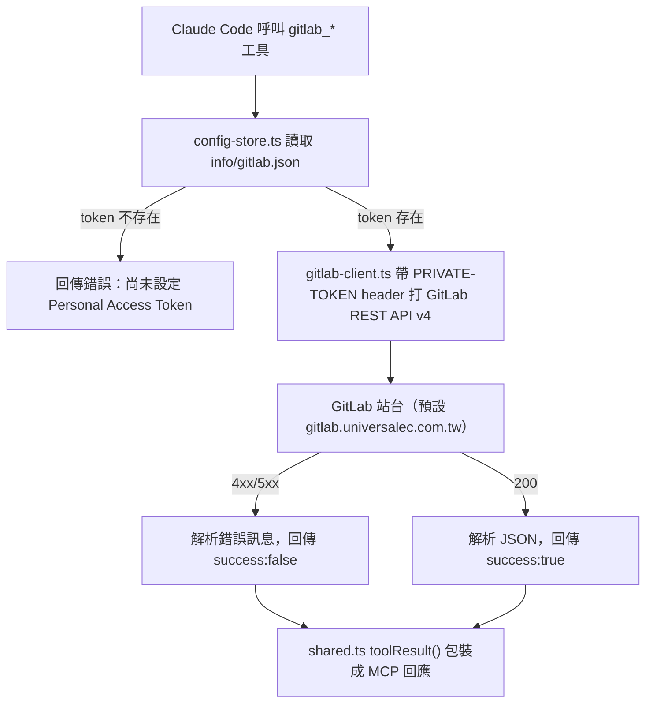
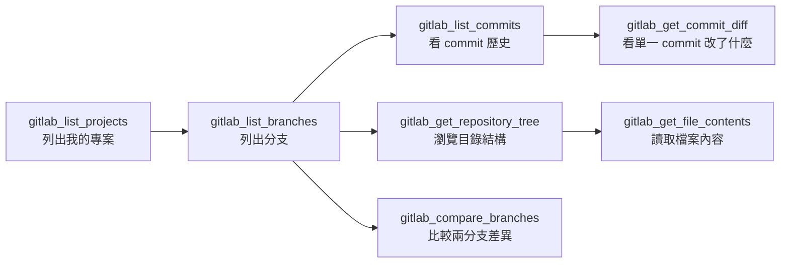

# gitlab-mcp

個人 GitLab MCP server（Personal Access Token）——查詢自己在 GitLab 上的專案、分支、commit 歷史、檔案內容。全部唯讀，不做任何寫入操作。

跟公司共用帳號的 GitLab 整合是分開的兩條路：共用帳號看到的是共用視角，這支 MCP 用你自己的 PAT，`gitlab_list_projects` 查出來的才是你個人實際參與/擁有的專案。

## 架構與流程



典型的查詢流程，由大範圍逐層鑽入到單一檔案：



## 設定

在這支 MCP 自己目錄下的 `info/gitlab.json`（已 gitignore，個人專屬，不進版控）：

```json
{
  "token": "你的 Personal Access Token（scope 只需要 read_api）",
  "baseUrl": "https://gitlab.universalec.com.tw"
}
```

`baseUrl` 可省略，預設就是上面這個站台。也可以用環境變數 `GITLAB_MCP_CONFIG_PATH` 指定其他設定檔路徑。

## 工具（全部唯讀）

| 工具 | 說明 |
|---|---|
| `gitlab_whoami` | 確認 token 有效，回傳登入的個人帳號 |
| `gitlab_list_projects` | 列出自己參與/擁有的專案 |
| `gitlab_get_project` | 單一專案詳細資訊 |
| `gitlab_list_branches` | 列出專案的分支 |
| `gitlab_get_branch` | 單一分支詳情 |
| `gitlab_list_commits` | 指定分支的 commit 歷史 |
| `gitlab_get_commit` | 單一 commit 詳情 |
| `gitlab_get_commit_diff` | 單一 commit 的 diff |
| `gitlab_compare_branches` | 兩分支/tag/SHA 之間的差異 |
| `gitlab_get_repository_tree` | 瀏覽分支底下的目錄結構 |
| `gitlab_get_file_contents` | 讀取分支上某檔案的內容（自動 base64 解碼） |

## 安裝

```bash
npm install
npm run build
```
