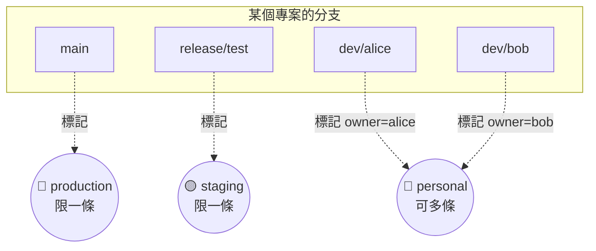

# gitlab-mcp 使用手冊

給非技術人員也看得懂的完整說明。工具名稱跟參數的技術對照表請見 [README](../README.md)。

## 目錄

- [這是什麼？](#這是什麼)
- [運作方式](#運作方式)
- [兩個帳號，兩個站台](#兩個帳號兩個站台)
- [工具總覽（白話版）](#工具總覽白話版)
- [分支用途標記詳解](#分支用途標記詳解)
- [實際範例](#實際範例)
- [常見問題](#常見問題)

## 這是什麼？

GitLab 是公司存放程式碼的地方——每個專案、每一次修改、每一條分支都記錄在上面。過去要查這些東西，得自己登入 GitLab 網站一層一層點。

現在你可以直接用中文跟 Claude 說「幫我查某個專案最近改了什麼」，Claude 會透過 **gitlab-mcp** 這個工具去 GitLab 上把資料抓回來，整理成看得懂的白話文回答你。

這個工具用的是**你自己申請的個人通行證**登入，看到的是你個人帳號實際有權限看的東西，不是某個共用帳號的視角。除了「分支用途標記」這個額外功能會記錄一些筆記在本機，其他一律只讀不寫——不會幫你改動或刪除 GitLab 上任何東西。

## 運作方式

一次查詢，經過這五個步驟：

你完全不需要知道中間發生了什麼，這只是說明給你聽。

## 兩個帳號，兩個站台

目前這支工具登記了兩組通行證，因為有兩個不同的 GitLab 站台。問問題時如果沒講清楚要查哪一個，Claude 會先跟你確認，不會亂猜。

| 連線 id | 站台 | 說明 |
|---|---|---|
| `gitlab` | `gitlab.universalec.com.tw` | 公司主要站台，用原本熟悉的那組帳號 |
| `gitlab2` | `gitlab2.universalec.com.tw` | 另一組獨立帳號，專案跟第一個站台是分開的 |

## 工具總覽（白話版）

總共九大類、25 個工具。

### 📂 帳號與專案

我有哪些專案、專案的基本資料。

> 可以這樣問：「我在 GitLab 上有哪些專案？」

- `gitlab_whoami` — 確認通行證還有效，順便看目前是哪個帳號登入的
- `gitlab_list_projects` — 列出你實際參與或擁有的專案
- `gitlab_get_project` — 看單一專案的詳細資料

### 🌿 分支

專案底下的各條開發線。

> 可以這樣問：「這個專案有哪些分支？」

- `gitlab_list_branches` — 列出專案的所有分支
- `gitlab_get_branch` — 看單一分支的細節，例如最新改到哪裡

### 🕘 修改紀錄

誰、什麼時候、改了什麼。

> 可以這樣問：「這個檔案最近被誰改過？」

- `gitlab_list_commits` — 列出修改歷史，由新到舊
- `gitlab_get_commit` — 看單一次修改的作者、時間、說明
- `gitlab_get_commit_diff` — 看單一次修改實際改了哪些程式碼
- `gitlab_compare_branches` — 比較兩條分支之間差了多少

### 🔍 檔案與搜尋

找檔案、看內容、搜關鍵字。

> 可以這樣問：「這個功能寫在哪個檔案？」

- `gitlab_get_repository_tree` — 瀏覽專案的資料夾結構
- `gitlab_get_file_contents` — 讀取某個檔案的內容
- `gitlab_search_code` — 直接搜尋關鍵字，快速找到相關檔案

### 🔀 合併請求（Merge Request）

別人提出的改動，等著被審核。

> 可以這樣問：「現在有哪些改動在等審核？」

- `gitlab_list_merge_requests` — 列出目前的合併請求
- `gitlab_get_merge_request` — 看單一筆的詳細狀態
- `gitlab_get_merge_request_changes` — 看這次改動實際改了什麼
- `gitlab_list_merge_request_discussions` — 看審核過程中的留言與意見

### 🐞 問題單（Issue）

記錄中的問題與待辦。

> 可以這樣問：「有哪些待處理的問題？」

- `gitlab_list_issues` — 列出問題單，可依狀態、標籤篩選
- `gitlab_get_issue` — 看單一問題單的詳細內容

### ⚙️ 建置與部署紀錄（Pipeline）

自動化流程有沒有跑成功。

> 可以這樣問：「最近一次上版的建置成功了嗎？」

- `gitlab_list_pipelines` — 列出建置/部署的執行紀錄
- `gitlab_get_pipeline` — 看單一次執行的整體結果
- `gitlab_list_pipeline_jobs` — 看是卡在哪一個步驟失敗的

### 🔌 連線清單

目前登記了哪些帳號可以查。

> 可以這樣問：「現在有設定哪些 GitLab 帳號？」

- `gitlab_list_connections` — 列出登記的帳號（不會顯示密碼/通行證本身）

### 🏷️ 分支用途標記（本機專屬功能）

記錄哪條分支是做什麼用的——這不是 GitLab 本身的功能，詳見下一節。

> 可以這樣問：「正式機現在是用哪條分支？」

- `gitlab_set_branch_role` — 標記某條分支的用途（會先向 GitLab 確認這條分支真的存在）
- `gitlab_get_deployment_branches` — 一次查出正式機、測試機各是哪條分支，個人分支有哪些人在用
- `gitlab_list_branch_roles` — 列出所有已標記過的分支
- `gitlab_remove_branch_role` — 取消某條分支的標記

## 分支用途標記詳解

GitLab 本身沒有「這條分支是拿來幹嘛」的欄位。這個功能讓你把分支貼上標籤，之後查「正式機該用哪條分支」就不用再翻紀錄用猜的。

同一個專案裡，**production** 跟 **staging** 各自只能貼在一條分支上——換一條貼，舊的那條會自動被取消標記。**personal** 沒有這個限制，每個人可以各自標自己的分支，會一併記錄「這是誰的」。

## 實際範例

### 情境一：確認正式機用哪條分支

> **你**：正式機現在是用哪個分支上版的？
>
> **Claude**：正式機目前標記的是 `main` 分支，最後更新在三天前。
> （背後呼叫：`gitlab_get_deployment_branches`）

### 情境二：了解這次上版改了什麼

> **你**：這次要上版的合併請求，實際上改了哪些東西？
>
> **Claude**：這個合併請求改了 3 個檔案：新增了一個驗證流程、修掉一個顯示錯誤的問題……（附上詳細清單）
> （背後呼叫：`gitlab_list_merge_requests` → `gitlab_get_merge_request_changes`）

### 情境三：找某個功能寫在哪裡

> **你**：請假流程的計算邏輯寫在哪個檔案？
>
> **Claude**：在 `leave-calculator.ts` 這個檔案裡，我幫你把內容抓出來了。
> （背後呼叫：`gitlab_search_code` → `gitlab_get_file_contents`）

## 常見問題

**這個工具會不會不小心改到或刪除 GitLab 上的東西？**
不會。除了「分支用途標記」是寫進本機的一份筆記檔案，其餘所有工具都只查詢、不寫入，GitLab 上的專案、分支、程式碼都不會被更動。

**為什麼有時候 Claude 會問我要查 gitlab 還是 gitlab2？**
因為目前登記了兩組不同站台的帳號，同一個專案名稱在兩邊可能都存在但內容不同。Claude 不會用猜的，會先跟你確認要查哪一邊。

**「分支用途標記」跟 GitLab 官方功能有什麼不一樣？**
GitLab 官方沒有「這條分支是正式機/測試機/個人用」這種欄位，這是額外做在這支工具裡的本機筆記功能，方便查詢，跟 GitLab 上真正的分支保護、部署環境設定是兩回事。

**如果我沒有自己的 GitLab 通行證會怎樣？**
工具會回覆「尚未設定通行證」，這時候找負責設定的人（IT 人員）幫忙申請一組唯讀用的個人通行證即可，不需要你自己動手設定任何檔案。
