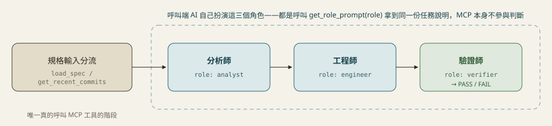
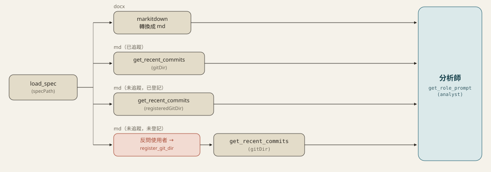

# spec-pipeline-mcp

給「規格 → 分析師 → 工程師 → 驗證師」流程用的 MCP Server。

這個 server 本身**不跑 LLM**，只提供工具；三個角色由呼叫端 AI 自己扮演，任務內容、硬性規則、輸出格式都在 `get_role_prompt` 工具裡（定義於 `src/prompts.ts`）——標準 MCP 協議，不限 Claude，任何 client 接上來拿到的都是同一套定義。

## 提供的工具

| 工具 | 用途 |
|------|------|
| `load_spec` | 判斷規格檔是 `.docx` 還是 `.md`，並針對 `.md` 判斷 git 追蹤狀態 |
| `register_git_dir` | 登記「規格目錄 → git 版控目錄」的對應關係（存在 `data/git-dir-map.json`） |
| `get_recent_commits` | 查詢指定 git 目錄的最新 commit，供分析師判讀 |
| `list_registered_git_dirs` | 列出目前已登記的對應關係，方便除錯 |
| `get_role_prompt` | 取得分析師／工程師／驗證師角色的完整說明（`role: "analyst" \| "engineer" \| "verifier"`） |

---

## 流程圖解

### 整體流程



只有「規格輸入分流」這站真的呼叫 MCP 工具；分析師／工程師／驗證師都是靠 `get_role_prompt` 拿說明，實際判斷全部是呼叫端 AI 自己做。

### 規格輸入分流的決策路徑



`load_spec({ specPath })` 回傳的關鍵欄位對照：

| 情況 | `gitTracked` | `registeredGitDir` | 接下來要做的事 |
|---|---|---|---|
| `.docx` | — | — | 用 `markitdown` 轉成 md，跳過版控，直接進分析師 |
| `.md`，已追蹤 | `true` | — | 直接 `get_recent_commits({ gitDir })` |
| `.md`，未追蹤但已登記過 | `false` | 有值 | 直接 `get_recent_commits({ gitDir: registeredGitDir })`，不用再問使用者 |
| `.md`，未追蹤也未登記 | `false` | `null`（`needsUserInput: true`） | 反問使用者版控目錄在哪 → `register_git_dir({ specDir, gitDir })` → `get_recent_commits` |

> **追蹤判斷用的是檔案層級檢查**（`git ls-files --error-unmatch`），不是「目錄是否位於某個 git 工作區之下」——後者會往上誤判到不相關的上層 repo（例如規格目錄剛好嵌在使用者整個家目錄底下、而家目錄本身意外是個 git repo），抓到完全不相關的 commit 歷史給分析師。

---

## 三個角色

三個角色的完整任務說明都在 `get_role_prompt(role)`，這裡只列輸入輸出的形狀，細節不重複貼：

| 角色 | 輸入 | 輸出 |
|---|---|---|
| 分析師 (`analyst`) | 規格內容 + `get_recent_commits` 的結果（docx 分支沒有 commit） | 需求分析（要改哪些模組、預期行為、邊界情況），交使用者確認 |
| 工程師 (`engineer`) | 分析師確認過的結論 | 實際改程式碼（用呼叫端自己的 Edit/Write，這個 MCP 不提供沙盒化的檔案工具） |
| 驗證師 (`verifier`) | 規格 + 分析師結論 + 工程師改動 | `PASS`/`FAIL` 結論，FAIL 要引用具體規格段落與程式碼位置 |

三站之間沒有強制的順序檢查（不像 `asana-pipeline-mcp` 有追蹤檔案卡關），完全靠呼叫端 AI 自律遵守「分析師疑問沒解完不能進工程師」這條規則。

---

## 安裝與註冊（在任何一台電腦上）

```bash
npm install
npm run build    # tsc 編譯到 dist/
npm link         # 把 dist/index.js 連結成全域指令
```

`npm link` 之後不管原始碼實際 clone 到哪個路徑，都會有全域指令 `spec-pipeline-mcp`（PATH 上）。Claude Code（或其他 client）的 `mcpServers` 一律用這個指令名稱，**不要寫絕對路徑**，換電腦只要重新 `npm install && npm run build && npm link` 一次。

### 在 Claude Code 中註冊

`~/.claude.json` 的 `mcpServers` 加入：

```json
"spec-pipeline": {
  "type": "stdio",
  "command": "spec-pipeline-mcp",
  "args": [],
  "env": {}
}
```

## 開發

```bash
npm run dev   # tsc --watch，邊改邊編譯
```

## 已知限制 / 尚未處理

- 沒有正式的自動化測試檔（開發過程用手動腳本驗證邏輯後即刪除），長期維護建議之後補一套 vitest 測試
