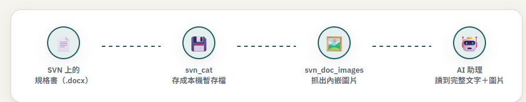

# svn-mcp

讓 AI 助理幫你查 SVN 上的程式碼跟規格文件：有哪些檔案、檔案內容長怎樣、改過什麼、跟上一版差在哪。**對 SVN 本身完全唯讀**，不會幫你改動或刪除任何東西。直接執行本機的 `svn` CLI，不依賴 claudeweb 或任何網站服務——stdio 工具（下表）跟 claudeweb 完全無關。

## 這是怎麼運作的


這支工具可以同時登記好幾組 SVN 連線，各給一個好記的名字。問問題時如果沒講清楚要查哪一個，AI 助理會先跟你確認可用的連線有哪些，不會亂猜。

## 讀規格書的完整流程

規格書（SA/SD）常常用 Word 文件撰寫，畫面設計、流程圖多半是用圖片貼進去的——只讀文字內容會漏掉這些關鍵資訊：



---

想要更完整、連非技術人員都看得懂的說明（含使用情境範例、常見問題），請見 **[docs/MANUAL.html](docs/MANUAL.html)**（排版過的網頁，GitHub 網頁上點開只會看到原始碼，要下載下來用瀏覽器打開才看得到排版後的樣子）。以下是給負責設定的人看的技術細節。

> **注意**：這份 README 曾經描述過一個更早期的架構（stdio 工具轉呼叫 claudeweb 的 SVN REST API，靠 `SVN_API_BASE` 指定 claudeweb 網址）。目前原始碼（`src/svn-client.ts`）已經沒有這個機制、也沒有讀取 `SVN_API_BASE` 這個環境變數了——已更新成下方實際的樣子。真正還會呼叫 claudeweb 的是另一個獨立元件，見下方「HTTP bridge」一節。

## 工具

全部對 SVN 唯讀。共 3 大類、7 個工具，點下面展開完整清單：

<details>
<summary>📋 展開完整工具清單（3 大類・7 個）</summary>

| 分類 | 工具 | 對應 `svn` 子命令 / 說明 |
|---|---|---|
| 連線管理 | `svn_list_connections` | 列出登記的連線（不含帳號密碼） |
| 連線管理 | `svn_test_connection` | 實際測試某個連線連不連得上（真的執行一次查詢） |
| 瀏覽與讀取 | `svn_browse` | `svn list`，列出某個路徑底下的檔案/資料夾 |
| 瀏覽與讀取 | `svn_cat` | `svn cat`，讀取檔案內容；文字檔直接回傳，Word/Excel/PDF 存成暫存檔交給既有文件讀取流程處理 |
| 瀏覽與讀取 | `svn_doc_images` | 把 Word/Excel 文件存成暫存檔，交給既有流程抽取內嵌圖片 |
| 修改歷史 | `svn_log` | `svn log`，查詢修訂記錄 |
| 修改歷史 | `svn_diff` | `svn diff`，比較兩個版本之間的差異 |

</details>

常見查詢鏈：不知道要查哪個連線 → `svn_list_connections` 查有哪些 → 帶進其他工具的 `connectionId`（可用 id 或 name）。讀 docx/xlsx 規格書時，`svn_cat` 讀文字之後記得再呼叫 `svn_doc_images` 讀圖片，畫面設計/流程圖常常只在圖片裡。

## 環境變數（stdio 工具）

| 變數 | 說明 | 預設值 |
|---|---|---|
| `SVN_CONNECTION_ID` | 預設使用的 SVN 連線 ID（沒指定就用這個） | 無（工具呼叫需自行指定連線） |
| `SVN_CONNECTIONS_FILE` | SVN 連線設定檔路徑（含各連線的 url/username/password） | 這個 MCP 自己目錄下的 `info/svn-connections.json` |
| `SVN_TIMEOUT_MS` | 執行 `svn` 指令的逾時毫秒數 | `30000` |

## HTTP bridge（`src/http-server.ts`，給 claudeweb 用的獨立介面）

跟上面的 stdio 工具是兩條完全不同的路——這是給 `claudeweb`（Java Web App，`C:\Tool\claudeweb`）依賴的持久化 HTTP 服務，讓它能對 `svn` CLI 下指令而不用自己重新實作一份。`claudeweb` 這邊透過 `svn.mcp.http.base`（預設 `http://localhost:8095`）呼叫，兩者設計上跑在同一台機器（`claudeweb` 會用 `ProcessBuilder` 直接在本機拉起 `dist-exe/svn-http-bridge.exe`）。

| 變數 | 說明 | 預設值 |
|---|---|---|
| `SVN_MCP_HTTP_PORT` | 監聽的埠號 | `8095` |
| `SVN_BRIDGE_HOST` | 綁定的網路介面 | `127.0.0.1`（只接受本機連線） |
| `SVN_BRIDGE_TOKEN` | 選配的共用密鑰，設定後 `POST /run` 要求 `Authorization: Bearer <token>` | 未設定（不驗證，僅靠 host 綁定防護） |

`POST /run` 只允許 `list`/`cat`/`log`/`diff`/`info` 這幾個唯讀子命令，且拒絕任何 `file://` 開頭的參數——這是給 claudeweb 瀏覽/讀取 SVN 用的橋接，不是任意執行 `svn` 指令的通道。

## 安裝

```bash
npm install
npm run build
```
