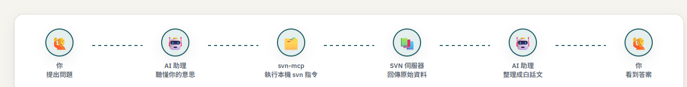
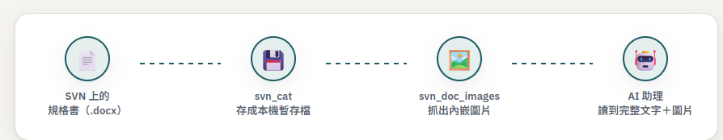

# svn-mcp

讓 AI 助理幫你查 SVN 上的程式碼跟規格文件：有哪些檔案、檔案內容長怎樣、改過什麼、跟上一版差在哪。**對 SVN 本身完全唯讀**，不會幫你改動或刪除任何東西。直接執行本機的 `svn` CLI，不依賴 claudeweb 或任何網站服務——stdio 工具（下表）跟 claudeweb 完全無關。

## 這是怎麼運作的



這支工具可以同時登記好幾組 SVN 連線，各給一個好記的名字。問問題時如果沒講清楚要查哪一個，AI 助理會先跟你確認可用的連線有哪些，不會亂猜。

## 讀規格書的完整流程

規格書（SA/SD）常常用 Word 文件撰寫，畫面設計、流程圖多半是用圖片貼進去的——只讀文字內容會漏掉這些關鍵資訊：



---

想要更完整、連非技術人員都看得懂的說明（含使用情境範例、常見問題），請見 **[docs/MANUAL.html](docs/MANUAL.html)**（排版過的網頁，GitHub 網頁上點開只會看到原始碼，要下載下來用瀏覽器打開才看得到排版後的樣子）。以下是給負責設定的人看的技術細節。

> **注意**：這份 README 曾經描述過一個更早期的架構（stdio 工具轉呼叫 claudeweb 的 SVN REST API，靠 `SVN_API_BASE` 指定 claudeweb 網址）。目前原始碼（`src/svn-client.ts`）已經沒有這個機制、也沒有讀取 `SVN_API_BASE` 這個環境變數了——已更新成下方實際的樣子。真正還會呼叫 claudeweb 的是另一個獨立元件，見下方「HTTP bridge」一節。

## 工具

全部對 SVN 唯讀。共 3 大類、7 個工具，點下面展開完整清單：

<details>
<summary>📋 展開完整工具清單（3 大類・7 個）</summary>

| 分類 | 工具 | 對應 `svn` 子命令 / 說明 |
|---|---|---|
| 連線管理 | `svn_list_connections` | 列出登記的連線（不含帳號密碼） |
| 連線管理 | `svn_test_connection` | 實際測試某個連線連不連得上（真的執行一次查詢） |
| 瀏覽與讀取 | `svn_browse` | `svn list`，列出某個路徑底下的檔案/資料夾 |
| 瀏覽與讀取 | `svn_cat` | `svn cat`，讀取檔案內容；文字檔直接回傳，Word/Excel/PDF 存成暫存檔交給既有文件讀取流程處理 |
| 瀏覽與讀取 | `svn_doc_images` | 把 Word/Excel 文件存成暫存檔，交給既有流程抽取內嵌圖片 |
| 修改歷史 | `svn_log` | `svn log`，查詢修訂記錄 |
| 修改歷史 | `svn_diff` | `svn diff`，比較兩個版本之間的差異 |

</details>

常見查詢鏈：不知道要查哪個連線 → `svn_list_connections` 查有哪些 → 帶進其他工具的 `connectionId`（可用 id 或 name）。讀 docx/xlsx 規格書時，`svn_cat` 讀文字之後記得再呼叫 `svn_doc_images` 讀圖片，畫面設計/流程圖常常只在圖片裡。

## 環境變數（stdio 工具）

| 變數 | 說明 | 預設值 |
|---|---|---|
| `SVN_CONNECTION_ID` | 預設使用的 SVN 連線 ID（沒指定就用這個） | 無（工具呼叫需自行指定連線） |
| `SVN_CONNECTIONS_FILE` | SVN 連線設定檔路徑（含各連線的 url/username/password） | 這個 MCP 自己目錄下的 `info/svn-connections.json` |
| `SVN_TIMEOUT_MS` | 執行 `svn` 指令的逾時毫秒數 | `30000` |

## HTTP bridge（`src/http-server.ts`，給 claudeweb 用的獨立介面）

跟上面的 stdio 工具是兩條完全不同的路——這是給 `claudeweb`（Java Web App，`C:\Tool\claudeweb`）依賴的持久化 HTTP 服務，讓它能對 `svn` CLI 下指令而不用自己重新實作一份。`claudeweb` 這邊透過 `svn.mcp.http.base`（預設 `http://localhost:8095`）呼叫，兩者設計上跑在同一台機器（`claudeweb` 會用 `ProcessBuilder` 直接在本機拉起 `dist-exe/svn-http-bridge.exe`）。

| 變數 | 說明 | 預設值 |
|---|---|---|
| `SVN_MCP_HTTP_PORT` | 監聽的埠號 | `8095` |
| `SVN_BRIDGE_HOST` | 綁定的網路介面 | `127.0.0.1`（只接受本機連線） |
| `SVN_BRIDGE_TOKEN` | 選配的共用密鑰，設定後 `POST /run` 要求 `Authorization: Bearer <token>` | 未設定（不驗證，僅靠 host 綁定防護） |

`POST /run` 只允許 `list`/`cat`/`log`/`diff`/`info` 這幾個唯讀子命令，且拒絕任何 `file://` 開頭的參數——這是給 claudeweb 瀏覽/讀取 SVN 用的橋接，不是任意執行 `svn` 指令的通道。

## 工作副本操作（不是 MCP 工具，AI 碰不到）

`src/workcopy-client.ts` 提供對本機 SVN 工作副本的 `status`／`diff`／`add + commit`／`update`／`delete`／`revert`／`cleanup` 函式，給 [`dev-pipeline-mcp`](../dev-pipeline-mcp) 的待人工處理報告網頁按鈕使用（使用者在網頁上勾選、填 commit 訊息、按上傳）。**這些函式刻意沒有註冊成任何 MCP 工具**——上面「工具」清單仍然是 AI 唯一能用的，全部唯讀；`tests/read-only-surface.test.mjs` 會鎖住註冊的工具清單，並檢查 `index.ts`／`*-tools.ts` 不得引用這個模組。

安全邊界：
- 工作副本必須真的是 SVN working copy，且遠端 URL 必須在指定連線的 URL 底下（以 `/` 為邊界比對，`.../repo2` 不算在 `.../repo` 底下）。
- 檔案路徑一律是相對於工作副本的路徑，不能是絕對路徑、不能含 `..` 或 `.svn`。
- commit 一律明確列出檔案（不會整份工作副本全部送出）、必須有非空訊息；中文訊息寫成 UTF-8 暫存檔以 `-F` 傳給 svn（直接用 `-m` 在 Windows 上會被轉成系統字碼頁而失敗）。
- commit 前會先把「新檔案」加入版控；commit 失敗會把這次剛做的加入動作還原（檔案內容不動）。
- 遇到衝突（含 tree conflict）一律拒絕、`update` 一律 `--accept postpone`，不自動解決；`~$` 開頭的 Office 暫存鎖定檔不列出、也不會被加入。
- `revert` 只允許用在新增／刪除／遺失三種狀態，不會丟掉任何已修改的內容——對資料夾是遞迴還原，所以底下只要有已修改的檔案就拒絕（以 `svn copy` 加入且沒修改過的資料夾，還原會移除那份複本，原件不受影響）；有未上傳修改的檔案不能直接標記刪除。
- 同一份工作副本的操作會排隊執行（SVN 對同一份工作副本平行操作會鎖死）。

測試：`npm test`（build 後跑 `node --test`）。工作副本的測試用本機臨時 SVN 儲存庫（`svnadmin create` + `file://`），不連任何真實 SVN，需要本機有 `svn`／`svnadmin`（TortoiseSVN 的 bin 目錄）。

## 遠端單一檔案編輯：svn-edit（不是 MCP 工具，AI 碰不到）

讓使用者不用手動 checkout，就能把 SVN 上的一個檔案（`.docx`／`.xlsx`／`.md`／`.txt`）取到暫存資料夾、用本機的 Word／Excel／編輯器改完，再上傳回 SVN。設計文件見 [docs/svn-edit-design.md](docs/svn-edit-design.md)。

- **核心**：`src/remote-edit-client.ts`（開啟、上傳、放棄、當機復原、衝突時另存最新版），跟 `workcopy-client.ts` 一樣**刻意沒有註冊成任何 MCP 工具**，`tests/read-only-surface.test.mjs` 會檢查 `index.ts`／`*-tools.ts` 不得引用。
- **入口**：`svn-edit` 本機服務（`src/edit-main.ts` → 打包成 `dist-exe/svn-edit.exe`），只綁 `127.0.0.1`，預設埠 `8096`。控制頁在 `http://127.0.0.1:8096/`；dev-pipeline 網頁按鈕只需要開啟 `http://127.0.0.1:8096/edit?connection=<連線名稱>&path=<遠端路徑>&ticket=<票號>`，服務會先顯示確認頁，使用者按「開始編輯」才真的取出檔案（GET 永遠不會改動任何狀態）。
- **自動拉起**：svn-mcp 啟動時會先檢查 `/health`，沒有在跑就拉起 svn-edit（冪等，已在跑就略過）。Windows 上透過 PowerShell 的 `Start-Process` 建立，確保服務不會握著 svn-mcp 的 MCP 通訊管道；沒有使用 Claude Code 的人可以直接雙擊 `svn-edit.exe`。沒有任何進行中的編輯且閒置超過 30 分鐘會自動結束。
- **連線設定**：與 svn-mcp 唯讀工具**共用同一份** `info/svn-connections.json`（`SVN_CONNECTIONS_FILE` 優先；執行檔預設讀「執行檔上一層」的 `info/`）。控制頁的「連線設定」可以新增、編輯連線，密碼不會再顯示出來，編輯時留空代表不變更。每位同事請使用自己的 SVN 帳號（SVN 的鎖是綁帳號的）。
- **瀏覽 SVN 目錄**：控制頁的「瀏覽 SVN 目錄」卡片可以逐層點進資料夾，點可編輯的檔案（docx、xlsx、md、txt）就跳到確認頁，同事不用記路徑。完全唯讀（只用 `svn list`）。API 是 `GET /api/browse?connection=…&path=…`。網址帶 `?connection=<連線名稱>&browse=<起始目錄>&ticket=<票號>` 進入控制頁會自動展開並載入該目錄，票號會一路帶到確認頁、預填 commit 訊息，dev-pipeline 的按鈕只需要組出這種連結。
- **新增檔案**：控制頁的「新增檔案到 SVN」可以選一個本機檔案、指定遠端路徑（資料夾不存在會自動建立）後直接加進 SVN（`svn import`，不需要本機工作副本）。遠端已有同名檔案一律拒絕、不覆蓋；依副檔名自動設定屬性：docx／xlsx 設 `svn:needs-lock`（編輯前要先鎖定），md／txt 設 `svn:eol-style=native`。API 是 `POST /api/import?connection=…&path=…&message=…`，檔案內容放在請求本文（原始位元組，上限 50 MB）。
- **一次編輯的流程**：取出單一檔案到 `%TEMP%\svn-edit\<id>\`（docx、xlsx 預設先 `svn lock`）→ 用預設程式開啟 → 使用者改完按「上傳」。上傳前檢查：Word／Excel 暫存鎖定檔（`~$`）還在就拒絕、內容沒變就拒絕、commit 訊息不能空、**遠端在你開啟後被別人更新就拒絕**（不自動合併，可「下載最新版另存」手動比對）。

| 變數 | 說明 | 預設值 |
|---|---|---|
| `SVN_EDIT_PORT` | svn-edit 監聽的埠號 | `8096` |
| `SVN_EDIT_TEMP_DIR` | 編輯項目的暫存資料夾（含稽核紀錄 `audit.log`） | `%TEMP%\svn-edit` |
| `SVN_EDIT_IDLE_MINUTES` | 沒有進行中的編輯且閒置多久後自動結束（0 代表不結束） | `30` |
| `SVN_EDIT_AUTOSTART` | 設成 `0` 可關閉 svn-mcp 啟動時自動拉起 svn-edit | 開啟 |
| `SVN_EDIT_NO_LAUNCH` | 設成 `1` 時不會真的開啟檔案或瀏覽器（自動化測試用） | 未設定 |

安全邊界：只能操作連線 URL 底下的單一檔案（拒絕 `..`、完整 URL，以及 Windows 不允許的字元 `: * ? " < > |`）、副檔名白名單加大小上限（50 MB）；`Host` 必須是 `127.0.0.1`／`localhost`、`/api/*` 一律要每次啟動隨機產生的 token、有 `Origin` 就必須是自己；每次開啟／上傳／放棄都寫稽核紀錄（commit 訊息只記長度與前 80 字）；錯誤訊息不會洩漏帳密。

打包：`npm run build:exe`（esbuild 打成單一 CJS，再用 `@yao-pkg/pkg` 產生 `dist-exe/svn-edit.exe`）。需要本機有 `svn` 命令列工具（TortoiseSVN 安裝時勾選 command line client tools），執行檔不隨附。

## 安裝

```bash
npm install
npm run build
```
